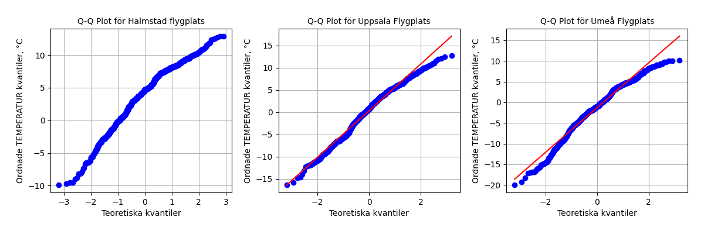
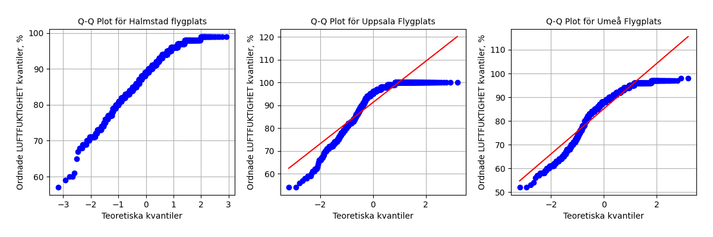

# PROJECT RAPPRORT for kurs Matematisk Modelering MA1487 HT24
*Olga Egorova, oleg22*

## Introduction

I projektet förväntas vi att plocka data från en open API och berbeta de med statistiska metoder.

## Uppgift 1-3. Databeskrivning och beskrivande diagrammer
*Uppgift 1: Beskriv data 
Introducera den data som valts och beskriv vad den visar och varifrån den kommer. Cirka 250 ord 
(halv A4). Var tydliga med vad de olika variablerna beskriver och i vilken enhet de är i. Det kan vara 
en god idé att ha en mindre tabell med ett urval från datan för att lättare beskriva mätvärdena.  
Det ska också finnas en visuell representation av hur datamängden ser ut, samt tillhörande figurtext 
med förklaringar till vad som visas och om det finns några konstigheter (till exempel outliers i datan). 
Visualiseringen görs med lämplig graf, t.ex. stapeldiagram, linjediagram, scatterplot, cirkeldiagram 
etc. Obs! Glöm inte att ange enheter på axlarna!*

Jag vädle att plocka data från [SMHI Open Data API Docs - Meteorological Observations](https://opendata.smhi.se/apidocs/metobs/index.html). Jag välde att plocka temperaturmätningar (parameter 1) och relativt luftfuktighet (parameter 6). Dessa mätningar pågar varje timme. Jag använder tre stationer: Halmstad flygplats, Uppsala Flygplats och Umeå Flygplats. Stations nämns som i SMHI Oen Data. Temperatur mäts i Celcie grad (°C) och Relativt luftfuktighet i procenter (%). Dataurval presenterades i [Tabel 1a](### Tabel 1a. TEMPERATUR per timme under sista tre dagar från tre stationer:) och [Tabel 1b](### Tabel 1b. LUFTFUKTIGHET per timme från tre stationer).
Koden till funktioner för att hämta data finns i [GitHub](https://github.com/OlganeOlga/MathMod/tree/master/get_dynam_data).

Dessa tabeller skapas med filen `get_dynam_data/prepere_data.py`
### Tabel 1a. TEMPERATUR per timme under sista tre dagar från tre stationer:
(exampel)
|                     |   Halmstad flygplats(°C) |   Uppsala Flygplats(°C) |   Umeå Flygplats(°C) |
|:--------------------|-------------------------:|------------------------:|---------------------:|
| 2024-12-15 17:00:00 |                      7.8 |                    -2.3 |                 -6.8 |
| 2024-12-15 18:00:00 |                      8.1 |                    -1.8 |                 -4.4 |
| 2024-12-15 19:00:00 |                      8.2 |                    -1.1 |                 -3.1 |
| 2024-12-15 20:00:00 |                      8.4 |                     0.4 |                 -1.3 |
| 2024-12-15 21:00:00 |                      8.2 |                     1.2 |                 -2.3 |
.......
| 2024-12-18 12:00:00 |                      6.1 |                     0.5 |                 -7.9 |
| 2024-12-18 13:00:00 |                      6   |                     1.6 |                 -6.8 |
| 2024-12-18 14:00:00 |                      6.5 |                     2.3 |                 -4.1 |
| 2024-12-18 15:00:00 |                      7   |                     2.7 |                 -3.4 |
| 2024-12-18 16:00:00 |                      7.4 |                     3.4 |                 -3.1 |
 
### Tabel 1b. LUFTFUKTIGHET per timme från tre stationer
(exampel)
|                     |   Halmstad flygplats(%) |   Uppsala Flygplats(%) |   Umeå Flygplats(%) |
|:--------------------|------------------------:|-----------------------:|--------------------:|
| 2024-12-15 17:00:00 |                      98 |                     99 |                  90 |
| 2024-12-15 18:00:00 |                      95 |                    100 |                  92 |
| 2024-12-15 19:00:00 |                      94 |                    100 |                  93 |
| 2024-12-15 20:00:00 |                      94 |                    100 |                  96 |
| 2024-12-15 21:00:00 |                      93 |                    100 |                  95 |
.........
| 2024-12-18 11:00:00 |                      96 |                     95 |                  90 |
| 2024-12-18 12:00:00 |                      96 |                    100 |                  92 |
| 2024-12-18 13:00:00 |                      98 |                    100 |                  93 |
| 2024-12-18 14:00:00 |                      97 |                    100 |                  95 |
| 2024-12-18 15:00:00 |                      96 |                    100 |                  95 |
| 2024-12-18 16:00:00 |                      96 |                    100 |                  96 |

Det finns möjlighet att hämta data på en dag eller på sista tre månader. För statstisk bearbetning användde jag data på de seanste tre dagar. Catof skafas med hjälp av följande funktion [`data_from_file()`](https://github.com/OlganeOlga/MathMod/blob/master/get_dynam_data/prepere_data.py)

Jag tittar om det finns missade data för [temperatur](### Tabel 2a.) och för [relativt luftfuktighet](### Tabel 2b.)

### Tabel 2a. [Missade data för TEMPERATUR](statistics/TEMPERATUR_mis_summ)           
|                    |   0 |                
|:-------------------|----:|                
| Halmstad flygplats |   0 |                
| Umeå Flygplats     |   0 |               
| Uppsala Flygplats  |   0 |               

### Tabel 2b. [Missade data för RELATIVT LUFTFUKTIGHET](statistics/LUFTFUKTIGHET_mis_summ) 
|                    |   0 |
|:-------------------|----:|
| Halmstad flygplats |   0 |
| Umeå Flygplats     |   0 |
| Uppsala Flygplats  |   0 |
Det verkar att inga tidspunkter var missad under dessa tre dagar.

Jag vill teasta om datamängd är normalfördelad. För detta skull använder jag Shapiro-Wilk test för normalitets sprigning.

### Tabel 3a. [Beskrivande statistik TEMPERATUR](statistics/TEMPERATUR_describe_stat.md)

Medelvärde i stationer Halmstad Flugplats och Upsala Flugplats är närmare medianen, som säger att de ssa data 
närmare normafördelning än data från Umeå Flugplats

### Tabel 3b. [Beskrivande statistik RELATIVT LUFTFUKTIGHET](statistics/LUFTFUKTIGHET_describe_stat.md)

*Med dessa plottar och Shapiro-Wilk test testar jag nulhypotes: att data är noirmalfördelad.*
Både plottar och Shapiro-Wilk test för normality tillåtar förkasta nulhypotes om att temperatur spridning är normal fördelad. Sannolikheten att nulhypotes stämmer är 3.78% för Halmstad flygplats, som är mindre än 5% och därmed är sannolikhet för typ II fel är ganska liten.
För andra två platser respectivt sannolikhheten för att nulhypotes stämmer är 0.29% och 0.02% och därmed är möjlighet för att felförkasta nulhypotes (fel typ II) är ännu mindre.

Om jag gör samma test för relativt lurftfuktighet visas det att luftfuktighet i Umeå Flugplats kan vara normalfördelad eftersom p_värde är 6.95% och större än 5%, dvs nulhypotes om att data är normalfördelade kan inta förkastas. Det är ppga stor sannoliket för fel typ II.
### Q_Q plottar
Det finns ett annat sät att visualisera avvikelse från normalfördelning, n-mligen [kvantil_kvantil plot](https://pubmed.ncbi.nlm.nih.gov/5661047/). Varje axel visar fördelningen av en dataset. I detta fall jämför jag dataset från olika stationer mot den teoretiska normalfördelningen. På X-axeln visas normafördelnings kvantiler, på Y-axeln visas kvantiler från respektiv datamängd (Tabel 3[a](### Tabel 3a)[b][### Tabel 3b])
### Tabel 3a

### Tabel 3b

Dess plottar visa samma: aärmast till normalfördelningen är data från station Halmstad flygplats, för både temperatur och relativt lyftfuktighet.

Jag kör samma test för tremånaders datamängd för att säkerställa om det ändå närmar sig normalfördelning
REtultater visas i Tabel 4 (Tabel 4[a](### Tabel 4a)[b][### Tabel 4b])
### Tabel 4a

### Tabel 4b

Dessa data avviker ännu mera från normalfördelning, därför är det svard att anvädna tester som är gjört för normalfördelning.

Eftersom data är inte normalfördelade försöker jag transformera de fär att hitta sätt att använda olika statistiska tester.

# Uppgift 4: Linjär regression 
Utför en linjärregression av minst en av variablerna och ett tillhörande 95% konfidensintervall. 
Rapportera variablerna 𝑎  och 𝑏  i sambandet 𝑦 = 𝑎 + 𝑏 ∙ 𝑥  samt punktskattningens 
konfidensintervall av dessa. Visualisera detta i en graf med den linjära modellen, konfidensintervallet 
och originaldata i samma figur.  
