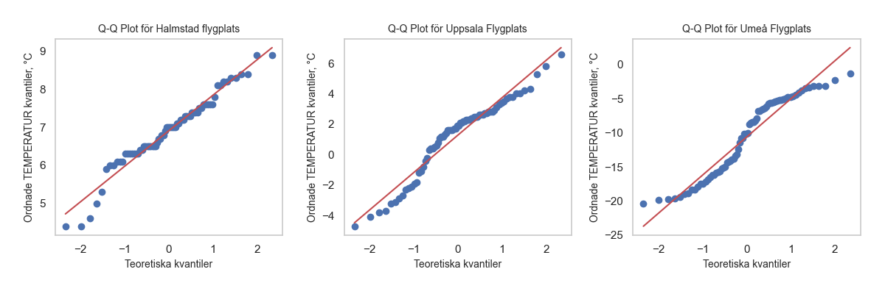
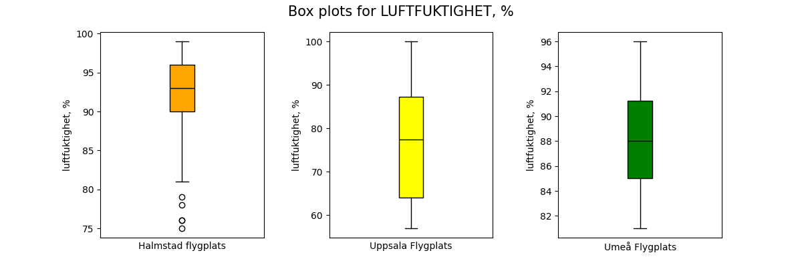
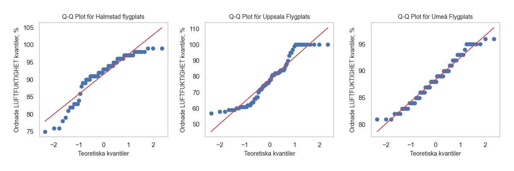

# PROJECT RAPPRORT for kurs Matematisk Modelering MA1487 HT24
*Olga Egorova, oleg22*

## Introduction

I projektet förväntas vi att plocka data från en open API och berbeta de med statistiska metoder.

## Uppgift 1. Databeskrivning

Jag hämtar data från [SMHI Open Data API Docs - Meteorological Observations](https://opendata.smhi.se/apidocs/metobs/index.html). Data i detta API beskriver väder fröändringar i olika platser i Sverige. Det finns flera olika mätningar, bland annat temperatur (parameter 1) och relativt luftfuktighet (parameter 6). Eftersom mätningar pågar varje timme, det känns lämpligt att använda data för att öva med statistisk bearbetning. Data hämtas från tre stationer: Halmstad flygplats, Uppsala Flygplats och Umeå Flygplats. Jag använder samma namn som i SMHI Open Data. Temperatur mäts i Celcie grader (°C) och relativt luftfuktighet i procenter (%). 

Kod som jag använder för att plocka data:

"""

    import json
    import request

    # variables 
    STATIONS = {'Halmstad flygplats': 62410, 'Uppsala Flygplats': 97530, 'Umeå Flygplats': 140480}
    COLORS = ["red"]
    # number of columns each dataframe
    NUM_COLUMNS = len(STATIONS)
    # Directory to save the data files and statistics
    OUTPUT_DIR = {"data":"smhi_data_temp_fukt", "img":"img", "statistics":"statistics"}
    #os.makedirs(OUTPUT_DIR["data"], exist_ok=True)
    COLORS = ["orange", "yellow", "green"]
    CUSTOM_CMAP = LinearSegmentedColormap.from_list(
        "CustomCmap", COLORS, N=256
    )
    # parameters to download (parameter_id:[name, unit])
    PARAMS = {1:["TEMPERATUR", "°C"], 6:["LUFTFUKTIGHET", "%"]}
    # period to request. Available periods: latest-hour, latest-day, latest-months or corrected-archive
    PERIOD = "latest-months"

    # This part i inactivated becouse i work with downloaded data
    # Dowloads data from three stations and for two parameters
    for key in PARAMS.keys():
        for station, id in STATIONS.items():
            data_url = f'https://opendata-download-metobs.smhi.se/api/version/1.0/parameter/{key}/station/{id}/period/{PERIOD}/data.json'
            response = requests.get(data_url)
            response.raise_for_status()  # Check if the request succeeded
            
            result = json.loads(response.content)
            save_path = f'{OUTPUT_DIR["data"]}/{id}_{key}.json'
            with open(save_path, "w", encoding="utf-8") as file:
                json.dump(result, file, indent=4, ensure_ascii=False)
"""

Data sparas data i filer, egen fil skaffas för varje station och variabel. Varje fil innehåller mera än 2500 mätnings punkter. För statistisk bearbetning hämtas data från sista 72 timmar med hjälp av förljande kod:

"""

    import datetime

    # Extract requaired period (tree days) from downloaded data
    mesured_points = 72 # how mach n will be in the data
    #all_data = {}
    three_days = {}

    data_rows = []

    # Create dictionary for three days data form each station in accending order
    for param_id, parameter in PARAMS.items():
        #station_data = {}
        three_d_station = {}
        for name, station_id in STATIONS.items():
            file_path = OUTPUT_DIR["data"] + '/' + f'{station_id}_{param_id}.json'
            with open(file_path, 'r') as file:
                data = json.load(file)
                #station_data[name] = data
                # Extract the "value" list and sort it by timestamp
                sorted_data = sorted(
                    data.get("value", []),
                    key=lambda x: datetime.fromtimestamp(x["date"] / 1000, tz=pytz.timezone("Europe/Stockholm"))
                )
                # Get the last N points
                last_points = sorted_data[-mesured_points:]
                """
                change it to pivot tabel
                """
            """the arrays' item are dictionary {key: {date, value and quality}}. 
            I want to remove quality but replace value to nympy.nan if quality is not G or Y
            """
            stat_set = {}
            for item in last_points:
                new_value = float(item['value']) if item['quality'] in ['G', 'Y'] else np.nan
                stat_set[item['date']] = new_value  # Add date-value pair to value_set
                time = datetime.fromtimestamp(item['date'] / 1000, tz=pytz.timezone("Europe/Stockholm"))
                value = float(item['value']) if item['quality'] in ['G', 'Y'] else np.nan

                # Append each row with the timestamp, station, parameter_id, and value
                data_rows.append({
                    'time': time,
                    'station_name': name,
                    'parameter': PARAMS[param_id][0],
                    'value': value
                })
            three_d_station[name] = stat_set
            
            three_days[param_id] = three_d_station
"""

Som resultat far jag nästlad diktionary: {Paramere_id: {plats:{timestamp:value}}}. Detta datatyp förändet jag till pandas <DataFrame> objekt. Ibbland anvädner jag separata objekt som innehåller bara en parameter. För de sista uppgifter använder jag objekt som innehåler båda parameter. Dataurval presenterades i Tabel 1a och 1b.
Koden till funktioner för att hämta data finns i [GitHub](https://github.com/OlganeOlga/MathMod/tree/master/get_dynam_data). Alla tabeller och figurer skapas med filen [ALL_CODE.py](ALL_CODE.py)

### Tabel 1a. TEMPERATUR per timme under sista tre dagar från tre stationer:
(exampel)
|      tid            |   Halmstad flygplats(°C) |   Uppsala Flygplats(°C) |   Umeå Flygplats(°C) |
|:--------------------|-------------------------:|------------------------:|---------------------:|
| 2024-12-15 17:00:00 |                      7.8 |                    -2.3 |                 -6.8 |
| 2024-12-15 18:00:00 |                      8.1 |                    -1.8 |                 -4.4 |
| 2024-12-15 19:00:00 |                      8.2 |                    -1.1 |                 -3.1 |
| 2024-12-15 20:00:00 |                      8.4 |                     0.4 |                 -1.3 |
| 2024-12-15 21:00:00 |                      8.2 |                     1.2 |                 -2.3 |
.......
| 2024-12-18 12:00:00 |                      6.1 |                     0.5 |                 -7.9 |
| 2024-12-18 13:00:00 |                      6   |                     1.6 |                 -6.8 |
| 2024-12-18 14:00:00 |                      6.5 |                     2.3 |                 -4.1 |
| 2024-12-18 15:00:00 |                      7   |                     2.7 |                 -3.4 |
| 2024-12-18 16:00:00 |                      7.4 |                     3.4 |                 -3.1 |
 
### Tabel 1b. LUFTFUKTIGHET per timme från tre stationer
(exampel)
|                     |   Halmstad flygplats(%) |   Uppsala Flygplats(%) |   Umeå Flygplats(%) |
|:--------------------|------------------------:|-----------------------:|--------------------:|
| 2024-12-15 17:00:00 |                      98 |                     99 |                  90 |
| 2024-12-15 18:00:00 |                      95 |                    100 |                  92 |
| 2024-12-15 19:00:00 |                      94 |                    100 |                  93 |
| 2024-12-15 20:00:00 |                      94 |                    100 |                  96 |
| 2024-12-15 21:00:00 |                      93 |                    100 |                  95 |
.........
| 2024-12-18 11:00:00 |                      96 |                     95 |                  90 |
| 2024-12-18 12:00:00 |                      96 |                    100 |                  92 |
| 2024-12-18 13:00:00 |                      98 |                    100 |                  93 |
| 2024-12-18 14:00:00 |                      97 |                    100 |                  95 |
| 2024-12-18 15:00:00 |                      96 |                    100 |                  95 |
| 2024-12-18 16:00:00 |                      96 |                    100 |                  96 |

För att lättare operera med data jag skaffar också kombinerad <DataFrame> objekt ´df_three´

'''
    # Convert the list of dictionaries into a pandas DataFrame objekt
    df_three = pd.DataFrame(data_rows)

    # Spara till en Markdown-fil
    markdown_string = df_three.to_markdown()  # Genererar Markdown-sträng
    with open("statistics/dataframe.md", "w", encoding="utf-8") as f:
        f.write(markdown_string)
'''

### Tabel 1c. Sammansätta data

|     | time                      | station_name       | parameter     |   value |
|----:|:--------------------------|:-------------------|:--------------|--------:|
|   0 | 2024-12-15 18:00:00+01:00 | Halmstad flygplats | TEMPERATUR    |     7.8 |
|   1 | 2024-12-15 19:00:00+01:00 | Halmstad flygplats | TEMPERATUR    |     8.1 |
.............
| 132 | 2024-12-18 06:00:00+01:00 | Uppsala Flygplats  | TEMPERATUR    |    -3.7 |
| 133 | 2024-12-18 07:00:00+01:00 | Uppsala Flygplats  | TEMPERATUR    |    -3.2 |
| 134 | 2024-12-18 08:00:00+01:00 | Uppsala Flygplats  | TEMPERATUR    |    -2.7 |
...............
| 214 | 2024-12-18 16:00:00+01:00 | Umeå Flygplats     | TEMPERATUR    |    -3.4 |
| 215 | 2024-12-18 17:00:00+01:00 | Umeå Flygplats     | TEMPERATUR    |    -3.1 |
| 216 | 2024-12-15 18:00:00+01:00 | Halmstad flygplats | LUFTFUKTIGHET |    98   |
| 217 | 2024-12-15 19:00:00+01:00 | Halmstad flygplats | LUFTFUKTIGHET |    95   |
...............
| 429 | 2024-12-18 15:00:00+01:00 | Umeå Flygplats     | LUFTFUKTIGHET |    95   |
| 430 | 2024-12-18 16:00:00+01:00 | Umeå Flygplats     | LUFTFUKTIGHET |    95   |
| 431 | 2024-12-18 17:00:00+01:00 | Umeå Flygplats     | LUFTFUKTIGHET |    96   |

Det är intressant att veta om vissa tidpunkter saknar någon av mätningar på något station.
Följande kode skaffar detta satistik:

'''
    # Count NaN values per station_name and parameter
    nan_counts = df_three.groupby(['station_name', 'parameter'])['value'].apply(lambda x: x.isna().sum()).reset_index()

    # Give name for columns
    nan_counts.columns = ['station_name', 'parameter', 'Missing values']
    utils.save_to_mdfile(nan_counts, "nan_counts.md", "statistics")

'''

Det verkar att inga mätningar är missade data för båda parameters under välde tiden:

### Tabel 2. [Missade data för alla parameter: ](statistics/nan_count.md)
|    | station_name       | parameter     |   Missing values |
|---:|:-------------------|:--------------|-----------------:|
|  0 | Halmstad flygplats | LUFTFUKTIGHET |                0 |
|  1 | Halmstad flygplats | TEMPERATUR    |                0 |
|  2 | Umeå Flygplats     | LUFTFUKTIGHET |                0 |
|  3 | Umeå Flygplats     | TEMPERATUR    |                0 |
|  4 | Uppsala Flygplats  | LUFTFUKTIGHET |                0 |
|  5 | Uppsala Flygplats  | TEMPERATUR    |                0 |

## Uppgift 2. Beskrivande statistik 

För att snabbt räkna ut statistiska egenskaper jag använder [describe()](https://www.bing.com/search?q=pandas+dataframe+describe&qs=SC&pq=pundas+dataframe+des&sc=8-20&cvid=5A1CCA0286C94253B1CE2447970B9A78&FORM=QBRE&sp=1&ghc=1&lq=0) metod fär pandas <DateFrame> objekt.
Jag urvalet anvädnes förljande kod:

'''
    descriptive_stats = df_three.groupby(['station_name', 'parameter'])['value'].describe()
'''

Resultat presenterad i följande tabellen:
### Tabell 3. Beskrivande statistik för alla stationer och 

|      staion, parameter, enheter       |   count |   mean |   std |   min |    25% |    50% |   75% |   max |
|:--------------------------------------|--------:|-------:|------:|------:|-------:|-------:|------:|------:|
| Halmstad flygplats, LUFTFUKTIGHET, %  |      72 |  91.47 |  5.98 |  75   |  90    |  93    | 96    |  99   |
| Halmstad flygplats, TEMPERATUR °C     |      72 |   6.91 |  0.93 |   4.4 |   6.38 |   7    |  7.43 |   8.9 |
| Umeå Flygplats, LUFTFUKTIGHET, %      |      72 |  88.38 |  4.1  |  81   |  85    |  88    | 91.25 |  96   |
| Umeå Flygplats, TEMPERATUR, °C        |      72 | -10.61 |  5.68 | -20.4 | -15.82 | -10.05 | -5.38 |  -1.3 |
| Uppsala Flygplats, LUFTFUKTIGHET, %   |      72 |  78.01 | 14.14 |  57   |  64    |  77.5  | 87.25 | 100   |
| Uppsala Flygplats, TEMPERATUR, °C     |      72 |   1.27 |  2.48 |  -4.7 |   0.18 |   1.9  |  2.72 |   6.6 |

Tabellen visar att alla stationer har 72 mätningar för båda parameter. Medelvärde är oftast inte avvikar mycket från medianen med undentag för temperatur i Umeå. Första och tredje kvartiler avstar ganska lika mycket från median, men minimala och maksimala värde avstar inte lika mycket från median.

Det är svårt att säga om data är normalfördelat enbart från resultater av tabellen. Jag skaffar därför plottar som visar hur data fördelade.

"""
    stations = df_three['station_name'].unique()
    parameters = df_three['parameter'].unique()

    plt.figure(figsize=(8, 6)) # initiate figure

    # Iterate through all stations and parameters
    for i, station in enumerate(stations):
        for j, parameter in enumerate(parameters):
            # filter data for each station and parameter
            data = df_three[(df_three['station_name'] == station) & (df_three['parameter'] == parameter)]

            # Subplot indexering: 3 rows for 3 stations and 2 columns for 2 parameters
            plt.subplot(3, 2, i * len(parameters) + j + 1) 
            
            # create histogramm
            sns.histplot(data['value'], kde=True, bins=24, color="green", edgecolor="black")
            
            # add title and axes
            plt.title(f"{station} - {parameter}")
            plt.xlabel("Värde")
            plt.ylabel("Frekvens")

    # Agast layout
    plt.tight_layout()
"""

Grafiska fördelningar visas i Figur [1](Figur 1)

Med  hjälp av Figur 1 vi ser att inte någon sätt av data är normalfördelad. Plottar visar ocjså att relativt luftfuktighet förändras inte likadant med temperaturförändring vid varje station. Här ifrån tar jag slutsatsen att det är inte lönt att bearbeta data från alla stationer tilsammans.

Ett annat sätt för att testa om data är normalfördelad är att använda [Shapiro-Wilk test](https://academic.oup.com/biomet/article-abstract/52/3-4/591/336553?redirectedFrom=fulltext) för normalitets sprigning.

Följande kode skaffar ladogrammer för varje station ohc parameter, samt gör Shapiro-Wilk test. TEst resultat visas på respektivt ladogramm.

'''
    # Unique stations and parameters
    stations = df_three['station_name'].unique()
    parameters = df_three['parameter'].unique()

    # Set up the figure
    fig, axes = plt.subplots(2, 3, figsize=(12, 4 * 2)) # 2 rows 3 columns

    # Loop over stations and parameters
    for i, parameter in enumerate(parameters):
        for j, station in enumerate(stations):
            # Filter data for the current station and parameter
            data_filtered = df_three[(df_three['station_name'] == station) & (df_three['parameter'] == parameter)]
            stat, p_value = sci.shapiro(data_filtered['value'])
            
            # Select the current axis
            ax = axes[i, j]
            
            # Create a boxplot
            sns.boxplot(
                ax=ax,
                data=data_filtered,
                x='station_name',  # Same station on x-axis
                y='value',
                hue='station_name',
                palette=[COLORS[j]],  # Assign unique color for the station
                width=0.3,
                dodge=False
            )
            
            # Rotate x-axis labels
            ax.tick_params(axis='x')
            
            # Add title and labels
            ax.set_title(f"{station} - {parameter}", fontsize=12)
            ax.set_xlabel("Station Name", fontsize=10)
            ax.set_ylabel("Value", fontsize=10)
            # Annotate p-value on the plot
            ax.text(
                0.9, 0.8,  # Position: center-top of the plot
                f"p={p_value:.3f}",
                transform=ax.transAxes,
                fontsize=10,
                ha='center',
                color='red' if p_value < 0.05 else 'black'
            )

    # Adjust layout
    plt.tight_layout()
'''

### Tabell 4. Shapiro-Wilk test

| Station            | Parameter     |   Shapiro-Wilk Statistic |   P-value | Normal Distribution (p > 0.05)   |
|:-------------------|:--------------|-------------------------:|----------:|:---------------------------------|
| Halmstad flygplats | LUFTFUKTIGHET |                    0.884 |     0     | No                               |
| Halmstad flygplats | TEMPERATUR    |                    0.964 |     0.038 | No                               |
| Umeå Flygplats     | LUFTFUKTIGHET |                    0.969 |     0.07  | Yes                              |
| Umeå Flygplats     | TEMPERATUR    |                    0.92  |     0     | No                               |
| Uppsala Flygplats  | LUFTFUKTIGHET |                    0.918 |     0     | No                               |
| Uppsala Flygplats  | TEMPERATUR    |                    0.944 |     0.003 | No                               |

*Med dessa plottar och Shapiro-Wilk test testar jag nulhypotes: att data är noirmalfördelad.*
Både plottar och Shapiro-Wilk test för normality tillåtar förkasta nulhypotes om att temperatur spridning är normal fördelad. Sannolikheten att nulhypotes stämmer är 3.78% för Halmstad flygplats, som är mindre än 5% och därmed är sannolikhet för typ II fel är ganska liten.
För andra två platser respectivt sannolikhheten för att nulhypotes stämmer är 0.29% och 0.02% och därmed är möjlighet för att felförkasta nulhypotes (fel typ II) är ännu mindre.
### Q_Q plottar
Det finns ett annat sät att visualisera avvikelse från normalfördelning, n-mligen [kvantil_kvantil plot](https://pubmed.ncbi.nlm.nih.gov/5661047/). Varje axel visar fördelningen av en dataset. I detta fall jämför jag dataset från olika stationer mot den teoretiska normalfördelningen. På X-axeln visas normafördelnings kvantiler, på Y-axeln visas kvantiler från respektiv datamängd (Tabel 3[a](### Tabel 3a)[b][### Tabel 3b])
### Fig 4a

### Tabel 3b. [Beskrivande statistik RELATIVT LUFTFUKTIGHET](statistics/LUFTFUKTIGHET_describe_stat.md)
Om jag gör samma test för relativt lurftfuktighet visas det att luftfuktighet i Umeå Flugplats kan vara normalfördelad eftersom p_värde är 6.95% och större än 5%, dvs nulhypotes om att data är normalfördelade kan inta förkastas. Det är ppga stor sannoliket för fel typ II.

### Tabel 4b

Dess plottar visa samma: aärmast till normalfördelningen är data från station Halmstad flygplats, för både temperatur och relativt lyftfuktighet.

# Uppgift 4: Linjär regression
jag ser hur korrelerar olika variabler med varandra

Matrix visar att den bästa correlation är mellan temperatur och relativt luftfuktighet i Umeå.
Därför välde jag att använda dessa variabler för liniar regression

*Utför en linjärregression av minst en av variablerna och ett tillhörande 95% konfidensintervall. 
Rapportera variablerna 𝑎  och 𝑏  i sambandet 𝑦 = 𝑎 + 𝑏 ∙ 𝑥  samt punktskattningens 
konfidensintervall av dessa. Visualisera detta i en graf med den linjära modellen, konfidensintervallet 
och originaldata i samma figur.*

Jag gör liniar regression för relativt luft fuktighet i Umea Fluglats. Jag väljer det datamängd eftersom fördelningen i detta grupp data är normal med största sannolikhet.
ganska