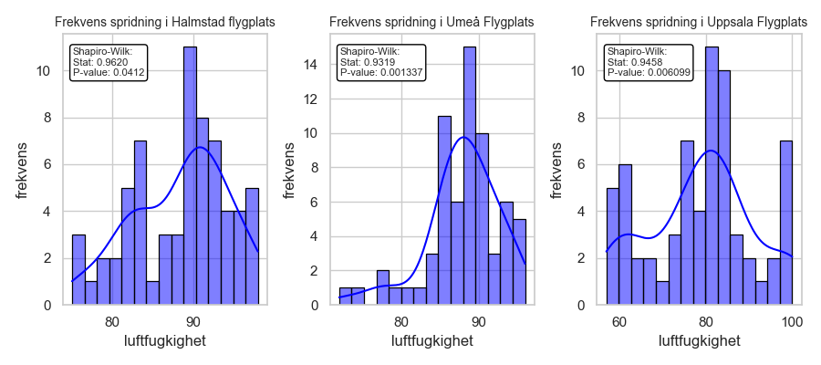

# PROJECT RAPPRORT for kurs Matematisk Modelering MA1487 HT24
*Olga Egorova, oleg22*

## Introduction

I projektet förväntas vi att plocka data från en open API och berbeta de med statistiska metoder.

## Uppgift 1. Databeskrivning
*Uppgift 1: Beskriv data 
Introducera den data som valts och beskriv vad den visar och varifrån den kommer. Cirka 250 ord 
(halv A4). Var tydliga med vad de olika variablerna beskriver och i vilken enhet de är i. Det kan vara 
en god idé att ha en mindre tabell med ett urval från datan för att lättare beskriva mätvärdena.  
Det ska också finnas en visuell representation av hur datamängden ser ut, samt tillhörande figurtext 
med förklaringar till vad som visas och om det finns några konstigheter (till exempel outliers i datan). 
Visualiseringen görs med lämplig graf, t.ex. stapeldiagram, linjediagram, scatterplot, cirkeldiagram 
etc. Obs! Glöm inte att ange enheter på axlarna!*


Jag vädle att plocka data från [SMHI Open Data API Docs - Meteorological Observations](https://opendata.smhi.se/apidocs/metobs/index.html). Jag välde att plocka temperaturmätningar (parameter 1) och relativt luftfuktighet (parameter 6). Dessa mätningar pågar varje timme. Jag använder tre stationer: Halmstad flygplats, Uppsala Flygplats och Umeå Flygplats. Stations nämns som i SMHI Oen Data. Temperatur mäts i Celcie grad (°C) och Relativt luftfuktighet i procenter (%). Dataurval presenterades i [Tabel 1a](### Tabel 1a. TEMPERATUR per timme under sista tre dagar från tre stationer:) och [Tabel 1b](### Tabel 1b. LUFTFUKTIGHET per timme från tre stationer).
Koden till funktioner för att hämta data finns i [GitHub](https://github.com/OlganeOlga/MathMod/tree/master/get_dynam_data).

Dessa tabeller skapas med filen `get_dynam_data/prepere_data.py`
### Tabel 1a. TEMPERATUR per timme under sista tre dagar från tre stationer:

|                     |   Halmstad flygplats(°C) |   Uppsala Flygplats(°C) |   Umeå Flygplats(°C) |
|:--------------------|-------------------------:|------------------------:|---------------------:|
| 2024-12-15 08:00:00 |                      3   |                    -1.7 |                -11.1 |
| 2024-12-15 09:00:00 |                      4.6 |                    -1.7 |                -12.4 |
| 2024-12-15 10:00:00 |                      5.3 |                    -1.8 |                -14.6 |
| 2024-12-15 11:00:00 |                      5.3 |                    -2   |                -13.2 |
.......
| 2024-12-17 06:00:00 |                      6.3 |                     2.3 |                 -4.7 |
| 2024-12-17 07:00:00 |                      6.3 |                     2.2 |                 -4.8 |
| 2024-12-17 08:00:00 |                      5.9 |                     2.1 |                 -5   |
| 2024-12-17 09:00:00 |                      6.5 |                     2.3 |                 -5.4 |
| 2024-12-17 10:00:00 |                      7.1 |                     2.6 |                 -5.2 |
| 2024-12-17 11:00:00 |                      7   |                     2.8 |                 -5.7 |
| 2024-12-17 12:00:00 |                      7   |                     2.9 |                 -8.4 |


### Tabel 1b. LUFTFUKTIGHET per timme från tre stationer
|                     |   Halmstad flygplats(%) |   Uppsala Flygplats(%) |   Umeå Flygplats(%) |
|:--------------------|------------------------:|-----------------------:|--------------------:|
| 2024-12-15 08:00:00 |                      89 |                     84 |                  89 |
| 2024-12-15 09:00:00 |                      88 |                     84 |                  88 |
| 2024-12-15 10:00:00 |                      86 |                     84 |                  85 |
| 2024-12-15 11:00:00 |                      86 |                     82 |                  88 |
| 2024-12-15 12:00:00 |                      90 |                     81 |                  86 |
| 2024-12-15 13:00:00 |                      96 |                     82 |                  88 |
| 2024-12-15 14:00:00 |                      97 |                     85 |                  86 |
| 2024-12-15 15:00:00 |                      98 |                     84 |                  87 |
| 2024-12-15 16:00:00 |                      98 |                     86 |                  88 |
| 2024-12-15 17:00:00 |                      98 |                     99 |                  90 |
| 2024-12-15 18:00:00 |                      95 |                    100 |                  92 |
.......
| 2024-12-17 08:00:00 |                      92 |                     62 |                  90 |
| 2024-12-17 09:00:00 |                      90 |                     61 |                  89 |
| 2024-12-17 10:00:00 |                      90 |                     59 |                  85 |
| 2024-12-17 11:00:00 |                      89 |                     58 |                  85 |
| 2024-12-17 12:00:00 |                      91 |                     57 |                  87 |

Det finns möjlighet att hämta data på en dag eller på sista tre månader. För statstisk bearbetning användde jag data på de seanste tre dagar. Catof skafas med hjälp av följande funktion
```
def data_from_file(stations=STATIONS,
                   dir: str=DIR,
                   param: int =1,
                   hours: int = 73):
    """
    Get data form fails return dictionary with name : data
    Args:
        data (dictionary): name:id of stations

    Returns:
        _dictionary_: name: data of stations
    """
    current_time = datetime.now(pytz.timezone("Europe/Stockholm"))
    rounded_time = current_time.replace(minute=0, second=0, microsecond=0)
    print(rounded_time)
    cutoff_time = rounded_time - timedelta(hours=hours)

    station_data = {}
    try:
        for name, station_id in stations.items():
            file_path = os.path.join(dir, f"{station_id}_{param}.json")
            with open(file_path, 'r') as file:
                data = json.load(file)
                # Filter and extract the last N hours data for the specific parameter
                filtered_data = [
                    entry for entry in data.get("value", [])
                    if datetime.fromtimestamp(entry["date"] / 1000, tz=pytz.timezone("Europe/Stockholm")) >= cutoff_time
                ]
            station_data[name] = filtered_data
    except FileNotFoundError:
        print(f"File '{file_path}' not found.")
    except json.JSONDecodeError:
        print("Error decoding JSON.")
    return station_data
```


Jag tittar om det finns missade data för [temperatur](### Tabel 2a. Missade data för TEMPERATUR) och för [relativt luftfuktighet](### Tabel 2b. Missade data för RELATIVT LUFTFUKTIGHET):

```
import pandas as pd
import get_dynam_data.prepere_data as p_d

# hämta data för TEMPERATUR
data = p_d.data_from_file(param=1)
three_days = p_d.extract_for_statistics(data=data)
df, stats = p_d.data_describe(three_days)


# sumanfattning för missade data: 
missing_summary = df.isna().sum()
p_d.append_to_markdown(missing_summary) 


# hämta data för RELATIVT LUFTFUKTIGHET
p_d.append_to_markdown(missing_summary)
data = p_d.data_from_file(param=6)
three_days = p_d.extract_for_statistics(data=data)
df, stats = p_d.data_describe(three_days)
# sumanfattning 
missing_summary = df.isna().sum()
p_d.append_to_markdown(missing_summary) 
```
----
### Tabel 2a. Missade data för TEMPERATUR            
|                    |   0 |                
|:-------------------|----:|                
| Halmstad flygplats |   0 |                
| Umeå Flygplats     |   0 |               
| Uppsala Flygplats  |   0 |               

### Tabel 2b. Missade data för RELATIVT LUFTFUKTIGHET
|                    |   0 |
|:-------------------|----:|
| Halmstad flygplats |   0 |
| Umeå Flygplats     |   0 |
| Uppsala Flygplats  |   0 |
Det verkar att inga tidspunkter var missad under dessa tre dagar.

Jag vill teasta om datamängd är normalfördelad. För detta skull använder jag Shapiro-Wilk test för normalitets sprigning.

### Tabel 3a. Beskrivande statistik TEMPERATUR
    mäts varje timme 
|       |   Halmstad flygplats(°C) |   Uppsala Flygplats(°C) |   Umeå Flygplats(°C) |
|:------|-------------------------:|------------------------:|---------------------:|
| count |                    53    |                   53    |                53    |
| mean  |                     6.99 |                    1.71 |                -9.07 |
| std   |                     1.14 |                    2.33 |                 4.58 |
| min   |                     3    |                   -2.5  |               -17.2  |
| 25%   |                     6.5  |                    1.2  |               -13.9  |
| 50%   |                     7.2  |                    2.3  |                -8.4  |
| 75%   |                     7.6  |                    2.9  |                -5.2  |
| max   |                     8.9  |                    6.6  |                -1.3  |

Medelvärde i stationer Halmstad Flugplats och Upsala Flugplats är närmare medianen, som säger att de ssa data 
närmare normafördelning än data från Umeå Flugplats

### Tabel 3b. Beskrivande statistik RELATIVT LUFTFUKTIGHET
    mäts varje timme 
|       |   Halmstad flygplats(%) |   Uppsala Flygplats(%) |   Umeå Flygplats(%) |
|:------|------------------------:|-----------------------:|--------------------:|
| count |                   53    |                  53    |               53    |
| mean  |                   89.32 |                  78.49 |               89.19 |
| std   |                    5.95 |                  13.36 |                3.16 |
| min   |                   75    |                  57    |               84    |
| 25%   |                   86    |                  66    |               87    |
| 50%   |                   91    |                  81    |               89    |
| 75%   |                   93    |                  85    |               91    |
| max   |                   98    |                 100    |               96    |


Dessa plottar visar tydligt att temperatur spridning är inte normal färdelad, desuttom normalfordelningstest 
visar väldignt litet sannolikhet för normalfördelning



Samma resultat visas gällande lurftfuktighet
