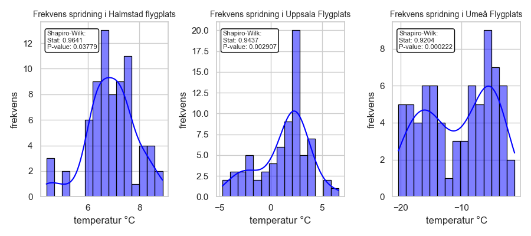
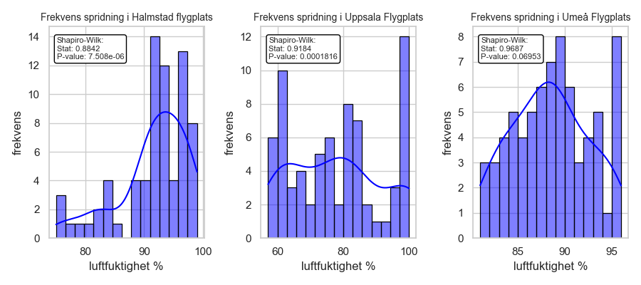

Uppgift 1: Beskriv data 
Introducera den data som valts och beskriv vad den visar och varifrån den kommer. Cirka 250 ord 
(halv A4). Var tydliga med vad de olika variablerna beskriver och i vilken enhet de är i. Det kan vara 
en god idé att ha en mindre tabell med ett urval från datan för att lättare beskriva mätvärdena.  
Det ska också finnas en visuell representation av hur datamängden ser ut, samt tillhörande figurtext 
med förklaringar till vad som visas och om det finns några konstigheter (till exempel outliers i datan). 
Visualiseringen görs med lämplig graf, t.ex. stapeldiagram, linjediagram, scatterplot, cirkeldiagram 
etc. Obs! Glöm inte att ange enheter på axlarna! 
### RESULTAT
Dessa tabeller skapas med filen `get_dynam_data/prepere_data.py`
## TEMPERATUR per timme under sista tre dagar från tre stationer:
|    time             |   Halmstad flygplats |   Umeå Flygplats |   Uppsala Flygplats |
|:--------------------|---------------------:|-----------------:|--------------------:|
| 2024-12-14 15:00:00 |                  5.3 |             -2.7 |                 1.6 |
| 2024-12-14 16:00:00 |                  5.1 |             -2.9 |                 1.6 |
| 2024-12-14 17:00:00 |                  4.6 |             -3.1 |                 1.6 |
| 2024-12-14 18:00:00 |                  4.2 |             -3.2 |                 1.2 |
| 2024-12-14 19:00:00 |                  4   |             -3.3 |                 0.9 |
...........
| 2024-12-17 10:00:00 |                  7.1 |             -5.2 |                 2.6 |
| 2024-12-17 11:00:00 |                  7   |             -5.7 |                 2.8 |
| 2024-12-17 12:00:00 |                  7   |             -8.4 |                 2.9 |


## LUFTFUKTIGHET per timme från tre stationer

|                     |   Halmstad flygplats |   Umeå Flygplats |   Uppsala Flygplats |
|:--------------------|---------------------:|-----------------:|--------------------:|
| 2024-12-14 15:00:00 |                   88 |               94 |                  99 |
| 2024-12-14 16:00:00 |                   87 |               93 |                  99 |
| 2024-12-14 17:00:00 |                   82 |               93 |                  96 |
| 2024-12-14 18:00:00 |                   82 |               93 |                  91 |
| 2024-12-14 19:00:00 |                   82 |               93 |                  90 |
| 2024-12-14 20:00:00 |                   84 |               91 |                  88 |
| 2024-12-14 21:00:00 |                   83 |               91 |                  86 |
......
| 2024-12-17 10:00:00 |                   90 |               85 |                  59 |
| 2024-12-17 11:00:00 |                   89 |               85 |                  58 |
| 2024-12-17 12:00:00 |                   91 |               87 |                  57 |


Jag tittar om det finns missade data:

```
import get_dynam_data.prepere_data as p_d

# missade data för temperatur
data = p_d.data_from_file(param=1)
three_days = p_d.extract_for_statistics(data=data)
df, stats = p_d.data_describe(three_days)

#get missing data:
missing_data = df.isna()
#summary of missing data: 
missing_summary = df.isna().sum()

p_d.append_to_markdown(missing_summary)
data = p_d.data_from_file(param=6)
three_days = p_d.extract_for_statistics(data=data)
df, stats = p_d.data_describe(three_days)

# missade data för LUFTFUKTIGHET
missing_data = df.isna()
#summary of missing data: 
missing_summary = df.isna().sum()
print(missing_summary)
p_d.append_to_markdown(missing_summary) ```
----
### Missade data för TEMPERATUR
|                    |   0 |
|:-------------------|----:|
| Halmstad flygplats |   0 |
| Umeå Flygplats     |   0 |
| Uppsala Flygplats  |   0 |

## Missade data för LUFTFUKTIGHET
|                    |   0 |
|:-------------------|----:|
| Halmstad flygplats |   0 |
| Umeå Flygplats     |   0 |
| Uppsala Flygplats  |   0 |

Det verkar att inga data missade för detta tids interval.
Dessa tabeller är skapade med samma fil som första två:

## Beskrivande statistik TEMPERATUR
|       |   Halmstad flygplats |   Umeå Flygplats |   Uppsala Flygplats |
|:------|---------------------:|-----------------:|--------------------:|
| count |             70       |         70       |            70       |
| mean  |              6.24714 |         -8.24857 |             1.30429 |
| std   |              1.67676 |          4.47164 |             2.22212 |
| min   |              2.7     |        -17.2     |            -2.5     |
| 25%   |              4.95    |        -12.15    |            -0.95    |
| 50%   |              6.9     |         -6.7     |             1.6     |
| 75%   |              7.475   |         -4.725   |             2.675   |
| max   |              8.9     |         -1.3     |             6.6     |

Medelvärde i stationer Halmstad Flugplats och Upsala Flugplats är närmare medianen, som säger att de ssa data 
närmare normafördelning än data från Umeå Flugplats

## Beskrivande statistik LUFTFUGTIGHET
|       |   Halmstad flygplats |   Umeå Flygplats |   Uppsala Flygplats |
|:------|---------------------:|-----------------:|--------------------:|
| count |             70       |         70       |             70      |
| mean  |             88.1571  |         88.2429  |             79.9429 |
| std   |              5.79264 |          4.76532 |             12.5269 |
| min   |             75       |         72       |             57      |
| 25%   |             83       |         86       |             74      |
| 50%   |             89       |         88.5     |             82      |
| 75%   |             92       |         91.75    |             86      |
| max   |             98       |         96       |            100      |



Dessa plottar visar tydligt att temperatur spridning är inte normal färdelad, desuttom normalfordelningstest 
visar väldignt litet sannolikhet för normalfördelning



Samma resultat visas gällande lurftfuktigheter