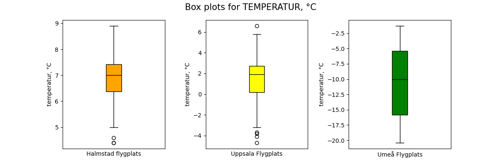

# PROJECT RAPPRORT for kurs Matematisk Modelering MA1487 HT24
*Olga Egorova, oleg22*

## Introduction

I projektet förväntas vi att plocka data från en open API och berbeta de med statistiska metoder.

## Uppgift 1. Databeskrivning

Jag hämtar data från [SMHI Open Data API Docs - Meteorological Observations](https://opendata.smhi.se/apidocs/metobs/index.html). Det finns flera olika mätningar, bland annat temperatur (parameter 1) och relativt luftfuktighet (parameter 6). Dessa mätningar pågar varje timme. Jag hämtar data för tre stationer: Halmstad flygplats, Uppsala Flygplats och Umeå Flygplats. Jag använder samma namn som i SMHI Oen Data. Temperatur mäts i Celcie grad (°C) och relativt luftfuktighet i procenter (%).

Kod som jag använder för att plocka data:

"""

    import json
    import request

    # variables 
    STATIONS = {'Halmstad flygplats': 62410, 'Uppsala Flygplats': 97530, 'Umeå Flygplats': 140480}
    COLORS = ["red"]
    # number of columns each dataframe
    NUM_COLUMNS = len(STATIONS)
    # Directory to save the data files and statistics
    OUTPUT_DIR = {"data":"smhi_data_temp_fukt", "img":"img", "statistics":"statistics"}
    #os.makedirs(OUTPUT_DIR["data"], exist_ok=True)
    COLORS = ["orange", "yellow", "green"]
    CUSTOM_CMAP = LinearSegmentedColormap.from_list(
        "CustomCmap", COLORS, N=256
    )
    # parameters to download (parameter_id:[name, unit])
    PARAMS = {1:["TEMPERATUR", "°C"], 6:["LUFTFUKTIGHET", "%"]}
    # period to request. Available periods: latest-hour, latest-day, latest-months or corrected-archive
    PERIOD = "latest-months"

    # This part i inactivated becouse i work with downloaded data
    # Dowloads data from three stations and for two parameters
    for key in PARAMS.keys():
        for station, id in STATIONS.items():
            data_url = f'https://opendata-download-metobs.smhi.se/api/version/1.0/parameter/{key}/station/{id}/period/{PERIOD}/data.json'
            response = requests.get(data_url)
            response.raise_for_status()  # Check if the request succeeded
            
            result = json.loads(response.content)
            save_path = f'{OUTPUT_DIR["data"]}/{id}_{key}.json'
            with open(save_path, "w", encoding="utf-8") as file:
                json.dump(result, file, indent=4, ensure_ascii=False)
"""

Data sparas data i filer, egen fil skaffas för varje station och variabel. För statistisk bearbetning hämtas data med hjälp av förljande kod:

"""

    import datetime

    # Extract requaired period (tree days) from downloaded data
    mesured_points = 72 # how mach n will be in the data
    #all_data = {}
    three_days = {}

    data_rows = []

    # Create dictionary for three days data form each station in accending order
    for param_id, parameter in PARAMS.items():
        #station_data = {}
        three_d_station = {}
        for name, station_id in STATIONS.items():
            file_path = OUTPUT_DIR["data"] + '/' + f'{station_id}_{param_id}.json'
            with open(file_path, 'r') as file:
                data = json.load(file)
                #station_data[name] = data
                # Extract the "value" list and sort it by timestamp
                sorted_data = sorted(
                    data.get("value", []),
                    key=lambda x: datetime.fromtimestamp(x["date"] / 1000, tz=pytz.timezone("Europe/Stockholm"))
                )
                # Get the last N points
                last_points = sorted_data[-mesured_points:]
                """
                change it to pivot tabel
                """
            """the arrays' item are dictionary {key: {date, value and quality}}. 
            I want to remove quality but replace value to nympy.nan if quality is not G or Y
            """
            stat_set = {}
            for item in last_points:
                new_value = float(item['value']) if item['quality'] in ['G', 'Y'] else np.nan
                stat_set[item['date']] = new_value  # Add date-value pair to value_set
                time = datetime.fromtimestamp(item['date'] / 1000, tz=pytz.timezone("Europe/Stockholm"))
                value = float(item['value']) if item['quality'] in ['G', 'Y'] else np.nan

                # Append each row with the timestamp, station, parameter_id, and value
                data_rows.append({
                    'time': time,
                    'station_name': name,
                    'parameter': PARAMS[param_id][0],
                    'value': value
                })
            three_d_station[name] = stat_set
            
            three_days[param_id] = three_d_station
"""

Som resultat far jag nästlad diktionary: {Paramere_id: {plats:{timestamp:value}}}. Detta datatyp förändet jag till pandas <DataFrame> objekt. Ibbland anvädner jag separata objekt som innehåller bara en parameter. För de sista uppgifter använder jag objekt som innehåler båda parameter. Dataurval presenterades i Tabel 1a och 1b.
Koden till funktioner för att hämta data finns i [GitHub](https://github.com/OlganeOlga/MathMod/tree/master/get_dynam_data). Alla tabeller och figurer skapas med filen [ALL_CODE.py](ALL_CODE.py)

### Tabel 1a. TEMPERATUR per timme under sista tre dagar från tre stationer:
(exampel)
|      tid            |   Halmstad flygplats(°C) |   Uppsala Flygplats(°C) |   Umeå Flygplats(°C) |
|:--------------------|-------------------------:|------------------------:|---------------------:|
| 2024-12-15 17:00:00 |                      7.8 |                    -2.3 |                 -6.8 |
| 2024-12-15 18:00:00 |                      8.1 |                    -1.8 |                 -4.4 |
| 2024-12-15 19:00:00 |                      8.2 |                    -1.1 |                 -3.1 |
| 2024-12-15 20:00:00 |                      8.4 |                     0.4 |                 -1.3 |
| 2024-12-15 21:00:00 |                      8.2 |                     1.2 |                 -2.3 |
.......
| 2024-12-18 12:00:00 |                      6.1 |                     0.5 |                 -7.9 |
| 2024-12-18 13:00:00 |                      6   |                     1.6 |                 -6.8 |
| 2024-12-18 14:00:00 |                      6.5 |                     2.3 |                 -4.1 |
| 2024-12-18 15:00:00 |                      7   |                     2.7 |                 -3.4 |
| 2024-12-18 16:00:00 |                      7.4 |                     3.4 |                 -3.1 |
 
### Tabel 1b. LUFTFUKTIGHET per timme från tre stationer
(exampel)
|                     |   Halmstad flygplats(%) |   Uppsala Flygplats(%) |   Umeå Flygplats(%) |
|:--------------------|------------------------:|-----------------------:|--------------------:|
| 2024-12-15 17:00:00 |                      98 |                     99 |                  90 |
| 2024-12-15 18:00:00 |                      95 |                    100 |                  92 |
| 2024-12-15 19:00:00 |                      94 |                    100 |                  93 |
| 2024-12-15 20:00:00 |                      94 |                    100 |                  96 |
| 2024-12-15 21:00:00 |                      93 |                    100 |                  95 |
.........
| 2024-12-18 11:00:00 |                      96 |                     95 |                  90 |
| 2024-12-18 12:00:00 |                      96 |                    100 |                  92 |
| 2024-12-18 13:00:00 |                      98 |                    100 |                  93 |
| 2024-12-18 14:00:00 |                      97 |                    100 |                  95 |
| 2024-12-18 15:00:00 |                      96 |                    100 |                  95 |
| 2024-12-18 16:00:00 |                      96 |                    100 |                  96 |

Jag använder pivottabel:
|       |   Halmstad flygplats LUFTFUKTIGHET |   Halmstad flygplats TEMPERATUR |   Ume� Flygplats LUFTFUKTIGHET |   Ume� Flygplats TEMPERATUR |   Uppsala Flygplats LUFTFUKTIGHET |   Uppsala Flygplats TEMPERATUR |
|:------|-----------------------------------:|--------------------------------:|-------------------------------:|----------------------------:|----------------------------------:|-------------------------------:|
| count |                              72    |                           72    |                          72    |                       72    |                             72    |                          72    |
| mean  |                              91.47 |                            6.91 |                          88.38 |                      -10.61 |                             78.01 |                           1.27 |
| std   |                               5.98 |                            0.93 |                           4.1  |                        5.68 |                             14.14 |                           2.48 |
| min   |                              75    |                            4.4  |                          81    |                      -20.4  |                             57    |                          -4.7  |
| 25%   |                              90    |                            6.38 |                          85    |                      -15.82 |                             64    |                           0.18 |
| 50%   |                              93    |                            7    |                          88    |                      -10.05 |                             77.5  |                           1.9  |
| 75%   |                              96    |                            7.43 |                          91.25 |                       -5.38 |                             87.25 |                           2.72 |
| max   |                              99    |                            8.9  |                          96    |                       -1.3  |                            100    |                           6.6  |

Jag tittar om det finns missade data för [temperatur](### Tabel 2a.) och för [relativt luftfuktighet](### Tabel 2b.)

### Tabel 2a. [Missade data för TEMPERATUR](statistics/TEMPERATUR_mis_summ.md)           
|                    |   0 |                
|:-------------------|----:|                
| Halmstad flygplats |   0 |                
| Umeå Flygplats     |   0 |               
| Uppsala Flygplats  |   0 |               

### Tabel 2b. [Missade data för RELATIVT LUFTFUKTIGHET](statistics/LUFTFUKTIGHET_mis_summ.md) 
|                    |   0 |
|:-------------------|----:|
| Halmstad flygplats |   0 |
| Umeå Flygplats     |   0 |
| Uppsala Flygplats  |   0 |

### Tabel 3c. [Missade data för alla parameter: ](statistics/ALLA_mis_summ.md)
|        station och parameter            |N missad|
|:----------------------------------------|-------:|
| ('Halmstad flygplats', 'LUFTFUKTIGHET') |   0    |
| ('Halmstad flygplats', 'TEMPERATUR')    |   0    |
| ('Umeå Flygplats', 'LUFTFUKTIGHET')     |   0    |
| ('Umeå Flygplats', 'TEMPERATUR')        |   0    |
| ('Uppsala Flygplats', 'LUFTFUKTIGHET')  |   0    |
| ('Uppsala Flygplats', 'TEMPERATUR')     |   0    |

Det verkar att inga tidspunkter var missad under dessa tre dagar.

Jag vill teasta om datamängd är normalfördelad. För detta skull använder jag Shapiro-Wilk test för normalitets sprigning.

### Tabel 3. [Beskrivande statistik for parameters](statistics/describe_stat_all.md)
station_name:          Halmstad flygplats            Umeå Flygplats            Uppsala Flygplats
parameter         LUFTFUKTIGHET TEMPERATUR  LUFTFUKTIGHET TEMPERATUR     LUFTFUKTIGHET TEMPERATUR
count                     72.00      72.00          72.00      72.00             72.00      72.00
mean                      91.47       6.91          88.38     -10.61             78.01       1.27
std                        5.98       0.93           4.10       5.68             14.14       2.48
min                       75.00       4.40          81.00     -20.40             57.00      -4.70
25%                       90.00       6.38          85.00     -15.82             64.00       0.18
50%                       93.00       7.00          88.00     -10.05             77.50       1.90
75%                       96.00       7.43          91.25      -5.38             87.25       2.72
max                       99.00       8.90          96.00      -1.30            100.00       6.60

Medelvärde i stationer Halmstad Flugplats och Upsala Flugplats är närmare medianen, som säger att de ssa data 
närmare normafördelning än data från Umeå Flugplats

*Med dessa plottar och Shapiro-Wilk test testar jag nulhypotes: att data är noirmalfördelad.*
Både plottar och Shapiro-Wilk test för normality tillåtar förkasta nulhypotes om att temperatur spridning är normal fördelad. Sannolikheten att nulhypotes stämmer är 3.78% för Halmstad flygplats, som är mindre än 5% och därmed är sannolikhet för typ II fel är ganska liten.
För andra två platser respectivt sannolikhheten för att nulhypotes stämmer är 0.29% och 0.02% och därmed är möjlighet för att felförkasta nulhypotes (fel typ II) är ännu mindre.
### Q_Q plottar
Det finns ett annat sät att visualisera avvikelse från normalfördelning, n-mligen [kvantil_kvantil plot](https://pubmed.ncbi.nlm.nih.gov/5661047/). Varje axel visar fördelningen av en dataset. I detta fall jämför jag dataset från olika stationer mot den teoretiska normalfördelningen. På X-axeln visas normafördelnings kvantiler, på Y-axeln visas kvantiler från respektiv datamängd (Tabel 3[a](### Tabel 3a)[b][### Tabel 3b])
### Fig 4a

### Tabel 3b. [Beskrivande statistik RELATIVT LUFTFUKTIGHET](statistics/LUFTFUKTIGHET_describe_stat.md)
Om jag gör samma test för relativt lurftfuktighet visas det att luftfuktighet i Umeå Flugplats kan vara normalfördelad eftersom p_värde är 6.95% och större än 5%, dvs nulhypotes om att data är normalfördelade kan inta förkastas. Det är ppga stor sannoliket för fel typ II.

### Tabel 4b

Dess plottar visa samma: aärmast till normalfördelningen är data från station Halmstad flygplats, för både temperatur och relativt lyftfuktighet.

# Uppgift 4: Linjär regression
jag ser hur korrelerar olika variabler med varandra

Matrix visar att den bästa correlation är mellan temperatur och relativt luftfuktighet i Umeå.
Därför välde jag att använda dessa variabler för liniar regression

*Utför en linjärregression av minst en av variablerna och ett tillhörande 95% konfidensintervall. 
Rapportera variablerna 𝑎  och 𝑏  i sambandet 𝑦 = 𝑎 + 𝑏 ∙ 𝑥  samt punktskattningens 
konfidensintervall av dessa. Visualisera detta i en graf med den linjära modellen, konfidensintervallet 
och originaldata i samma figur.*

Jag gör liniar regression för relativt luft fuktighet i Umea Fluglats. Jag väljer det datamängd eftersom fördelningen i detta grupp data är normal med största sannolikhet.
