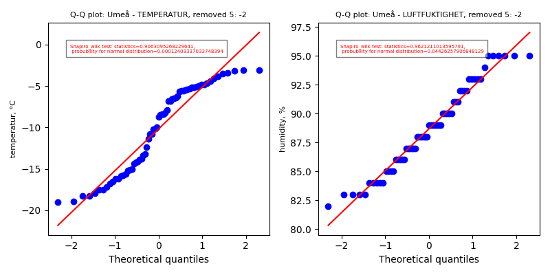
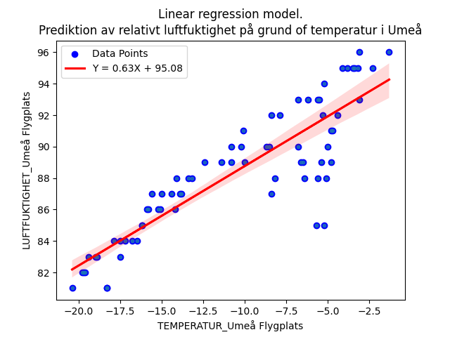

# PROJECT RAPPRORT for kurs Matematisk Modelering MA1487 HT24
*Olga Egorova, oleg22*

## Introduction

I projektet förväntas vi att plocka data från en open API och berbeta de med statistiska metoder.

## Uppgift 1. Databeskrivning

Jag hämtar data från [SMHI Open Data API Docs - Meteorological Observations](https://opendata.smhi.se/apidocs/metobs/index.html). Data i detta API beskriver väder fröändringar i olika platser i Sverige. Det finns flera olika mätningar, bland annat temperatur (parameter 1) och relativt luftfuktighet (parameter 6). Eftersom mätningar pågar varje timme, det känns lämpligt att använda data för att öva med statistisk bearbetning. Data hämtas från tre stationer: Halmstad flygplats, Uppsala Flygplats och Umeå Flygplats. Jag använder samma namn som i SMHI Open Data. Temperatur mäts i Celcie grader (°C) och relativt luftfuktighet i procenter (%). 

Kod som jag använder för att plocka data:

"""

    import json
    import request

    # variables 
    STATIONS = {'Halmstad flygplats': 62410, 'Uppsala Flygplats': 97530, 'Umeå Flygplats': 140480}
    COLORS = ["red"]
    # number of columns each dataframe
    NUM_COLUMNS = len(STATIONS)
    # Directory to save the data files and statistics
    OUTPUT_DIR = {"data":"smhi_data_temp_fukt", "img":"img", "statistics":"statistics"}
    #os.makedirs(OUTPUT_DIR["data"], exist_ok=True)
    COLORS = ["orange", "yellow", "green"]
    CUSTOM_CMAP = LinearSegmentedColormap.from_list(
        "CustomCmap", COLORS, N=256
    )
    # parameters to download (parameter_id:[name, unit])
    PARAMS = {1:["TEMPERATUR", "°C"], 6:["LUFTFUKTIGHET", "%"]}
    # period to request. Available periods: latest-hour, latest-day, latest-months or corrected-archive
    PERIOD = "latest-months"

    # This part i inactivated becouse i work with downloaded data
    # Dowloads data from three stations and for two parameters
    for key in PARAMS.keys():
        for station, id in STATIONS.items():
            data_url = f'https://opendata-download-metobs.smhi.se/api/version/1.0/parameter/{key}/station/{id}/period/{PERIOD}/data.json'
            response = requests.get(data_url)
            response.raise_for_status()  # Check if the request succeeded
            
            result = json.loads(response.content)
            save_path = f'{OUTPUT_DIR["data"]}/{id}_{key}.json'
            with open(save_path, "w", encoding="utf-8") as file:
                json.dump(result, file, indent=4, ensure_ascii=False)
"""

Data sparas data i filer, egen fil skaffas för varje station och variabel. Varje fil innehåller mera än 2500 mätnings punkter. För statistisk bearbetning hämtas data från sista 72 timmar med hjälp av förljande kod:

"""

    import datetime

    # Extract requaired period (tree days) from downloaded data
    mesured_points = 72 # how mach n will be in the data
    #all_data = {}
    three_days = {}

    data_rows = []

    # Create dictionary for three days data form each station in accending order
    for param_id, parameter in PARAMS.items():
        #station_data = {}
        three_d_station = {}
        for name, station_id in STATIONS.items():
            file_path = OUTPUT_DIR["data"] + '/' + f'{station_id}_{param_id}.json'
            with open(file_path, 'r') as file:
                data = json.load(file)
                #station_data[name] = data
                # Extract the "value" list and sort it by timestamp
                sorted_data = sorted(
                    data.get("value", []),
                    key=lambda x: datetime.fromtimestamp(x["date"] / 1000, tz=pytz.timezone("Europe/Stockholm"))
                )
                # Get the last N points
                last_points = sorted_data[-mesured_points:]
                """
                change it to pivot tabel
                """
            """the arrays' item are dictionary {key: {date, value and quality}}. 
            I want to remove quality but replace value to nympy.nan if quality is not G or Y
            """
            stat_set = {}
            for item in last_points:
                new_value = float(item['value']) if item['quality'] in ['G', 'Y'] else np.nan
                stat_set[item['date']] = new_value  # Add date-value pair to value_set
                time = datetime.fromtimestamp(item['date'] / 1000, tz=pytz.timezone("Europe/Stockholm"))
                value = float(item['value']) if item['quality'] in ['G', 'Y'] else np.nan

                # Append each row with the timestamp, station, parameter_id, and value
                data_rows.append({
                    'time': time,
                    'station_name': name,
                    'parameter': PARAMS[param_id][0],
                    'value': value
                })
            three_d_station[name] = stat_set
            
            three_days[param_id] = three_d_station
"""

Som resultat far jag nästlad diktionary: {Paramere_id: {plats:{timestamp:value}}}. Detta datatyp förändet jag till pandas <DataFrame> objekt. Ibbland anvädner jag separata objekt som innehåller bara en parameter. För de sista uppgifter använder jag objekt som innehåler båda parameter. Dataurval presenterades i Tabel 1a och 1b.
Koden till funktioner för att hämta data finns i [GitHub](https://github.com/OlganeOlga/MathMod/tree/master/get_dynam_data). Alla tabeller och figurer skapas med filen [ALL_CODE.py](ALL_CODE.py)

#### Tabel 1a. TEMPERATUR per timme under sista tre dagar från tre stationer:
(exampel)
|      tid            |   Halmstad flygplats(°C) |   Uppsala Flygplats(°C) |   Umeå Flygplats(°C) |
|:--------------------|-------------------------:|------------------------:|---------------------:|
| 2024-12-15 17:00:00 |                      7.8 |                    -2.3 |                 -6.8 |
| 2024-12-15 18:00:00 |                      8.1 |                    -1.8 |                 -4.4 |
| 2024-12-15 19:00:00 |                      8.2 |                    -1.1 |                 -3.1 |
| 2024-12-15 20:00:00 |                      8.4 |                     0.4 |                 -1.3 |
| 2024-12-15 21:00:00 |                      8.2 |                     1.2 |                 -2.3 |
.......
| 2024-12-18 12:00:00 |                      6.1 |                     0.5 |                 -7.9 |
| 2024-12-18 13:00:00 |                      6   |                     1.6 |                 -6.8 |
| 2024-12-18 14:00:00 |                      6.5 |                     2.3 |                 -4.1 |
| 2024-12-18 15:00:00 |                      7   |                     2.7 |                 -3.4 |
| 2024-12-18 16:00:00 |                      7.4 |                     3.4 |                 -3.1 |
 
#### Tabel 1b. LUFTFUKTIGHET per timme från tre stationer
(exampel)
|                     |   Halmstad flygplats(%) |   Uppsala Flygplats(%) |   Umeå Flygplats(%) |
|:--------------------|------------------------:|-----------------------:|--------------------:|
| 2024-12-15 17:00:00 |                      98 |                     99 |                  90 |
| 2024-12-15 18:00:00 |                      95 |                    100 |                  92 |
| 2024-12-15 19:00:00 |                      94 |                    100 |                  93 |
| 2024-12-15 20:00:00 |                      94 |                    100 |                  96 |
| 2024-12-15 21:00:00 |                      93 |                    100 |                  95 |
.........
| 2024-12-18 11:00:00 |                      96 |                     95 |                  90 |
| 2024-12-18 12:00:00 |                      96 |                    100 |                  92 |
| 2024-12-18 13:00:00 |                      98 |                    100 |                  93 |
| 2024-12-18 14:00:00 |                      97 |                    100 |                  95 |
| 2024-12-18 15:00:00 |                      96 |                    100 |                  95 |
| 2024-12-18 16:00:00 |                      96 |                    100 |                  96 |

För att lättare operera med data jag skaffar också kombinerad <DataFrame> objekt ´df_three´

'''
    # Convert the list of dictionaries into a pandas DataFrame objekt
    df_three = pd.DataFrame(data_rows)

    # Spara till en Markdown-fil
    markdown_string = df_three.to_markdown()  # Genererar Markdown-sträng
    with open("statistics/dataframe.md", "w", encoding="utf-8") as f:
        f.write(markdown_string)
'''

#### Tabel 1c. Sammansätta data

|     | time                      | station_name       | parameter     |   value |
|----:|:--------------------------|:-------------------|:--------------|--------:|
|   0 | 2024-12-15 18:00:00+01:00 | Halmstad flygplats | TEMPERATUR    |     7.8 |
|   1 | 2024-12-15 19:00:00+01:00 | Halmstad flygplats | TEMPERATUR    |     8.1 |
.............
| 132 | 2024-12-18 06:00:00+01:00 | Uppsala Flygplats  | TEMPERATUR    |    -3.7 |
| 133 | 2024-12-18 07:00:00+01:00 | Uppsala Flygplats  | TEMPERATUR    |    -3.2 |
| 134 | 2024-12-18 08:00:00+01:00 | Uppsala Flygplats  | TEMPERATUR    |    -2.7 |
...............
| 214 | 2024-12-18 16:00:00+01:00 | Umeå Flygplats     | TEMPERATUR    |    -3.4 |
| 215 | 2024-12-18 17:00:00+01:00 | Umeå Flygplats     | TEMPERATUR    |    -3.1 |
| 216 | 2024-12-15 18:00:00+01:00 | Halmstad flygplats | LUFTFUKTIGHET |    98   |
| 217 | 2024-12-15 19:00:00+01:00 | Halmstad flygplats | LUFTFUKTIGHET |    95   |
...............
| 429 | 2024-12-18 15:00:00+01:00 | Umeå Flygplats     | LUFTFUKTIGHET |    95   |
| 430 | 2024-12-18 16:00:00+01:00 | Umeå Flygplats     | LUFTFUKTIGHET |    95   |
| 431 | 2024-12-18 17:00:00+01:00 | Umeå Flygplats     | LUFTFUKTIGHET |    96   |

Det är intressant att veta om vissa tidpunkter saknar någon av mätningar på något station.
Följande kode skaffar detta satistik:

'''
    # Count NaN values per station_name and parameter
    nan_counts = df_three.groupby(['station_name', 'parameter'])['value'].apply(lambda x: x.isna().sum()).reset_index()

    # Give name for columns
    nan_counts.columns = ['station_name', 'parameter', 'Missing values']
    utils.save_to_mdfile(nan_counts, "nan_counts.md", "statistics")

'''

Det verkar att inga mätningar är missade data för båda parameters under välde tiden:

#### Tabel 2. [Missade data för alla parameter: ](statistics/nan_count.md)
|    | station_name       | parameter     |   Missing values |
|---:|:-------------------|:--------------|-----------------:|
|  0 | Halmstad flygplats | LUFTFUKTIGHET |                0 |
|  1 | Halmstad flygplats | TEMPERATUR    |                0 |
|  2 | Umeå Flygplats     | LUFTFUKTIGHET |                0 |
|  3 | Umeå Flygplats     | TEMPERATUR    |                0 |
|  4 | Uppsala Flygplats  | LUFTFUKTIGHET |                0 |
|  5 | Uppsala Flygplats  | TEMPERATUR    |                0 |

## Uppgift 2. Beskrivande statistik 

För att snabbt räkna ut statistiska egenskaper jag använder [describe()](https://www.bing.com/search?q=pandas+dataframe+describe&qs=SC&pq=pundas+dataframe+des&sc=8-20&cvid=5A1CCA0286C94253B1CE2447970B9A78&FORM=QBRE&sp=1&ghc=1&lq=0) metod fär pandas <DateFrame> objekt.
Jag urvalet anvädnes förljande kod:

'''
    descriptive_stats = df_three.groupby(['station_name', 'parameter'])['value'].describe()
'''

Resultat presenterad i följande tabellen:
### Tabell 3. Beskrivande statistik för alla stationer och 

|      staion, parameter, enheter       |   count |   mean |   std |   min |    25% |    50% |   75% |   max |
|:--------------------------------------|--------:|-------:|------:|------:|-------:|-------:|------:|------:|
| Halmstad flygplats, LUFTFUKTIGHET, %  |      72 |  91.47 |  5.98 |  75   |  90    |  93    | 96    |  99   |
| Halmstad flygplats, TEMPERATUR °C     |      72 |   6.91 |  0.93 |   4.4 |   6.38 |   7    |  7.43 |   8.9 |
| Umeå Flygplats, LUFTFUKTIGHET, %      |      72 |  88.38 |  4.1  |  81   |  85    |  88    | 91.25 |  96   |
| Umeå Flygplats, TEMPERATUR, °C        |      72 | -10.61 |  5.68 | -20.4 | -15.82 | -10.05 | -5.38 |  -1.3 |
| Uppsala Flygplats, LUFTFUKTIGHET, %   |      72 |  78.01 | 14.14 |  57   |  64    |  77.5  | 87.25 | 100   |
| Uppsala Flygplats, TEMPERATUR, °C     |      72 |   1.27 |  2.48 |  -4.7 |   0.18 |   1.9  |  2.72 |   6.6 |

Tabellen visar att alla stationer har 72 mätningar för båda parameter. Medelvärde är oftast inte avvikar mycket från medianen med undentag för temperatur i Umeå. Första och tredje kvartiler avstar ganska lika mycket från median, men minimala och maksimala värde avstar inte lika mycket från median.

Det är svårt att säga om data är normalfördelat enbart från resultater av tabellen. Jag skaffar därför plottar som visar hur data fördelade.

"""
    stations = df_three['station_name'].unique()
    parameters = df_three['parameter'].unique()

    plt.figure(figsize=(8, 6)) # initiate figure

    # Iterate through all stations and parameters
    for i, station in enumerate(stations):
        for j, parameter in enumerate(parameters):
            # filter data for each station and parameter
            data = df_three[(df_three['station_name'] == station) & (df_three['parameter'] == parameter)]

            # Subplot indexering: 3 rows for 3 stations and 2 columns for 2 parameters
            plt.subplot(3, 2, i * len(parameters) + j + 1) 
            
            # create histogramm
            sns.histplot(data['value'], kde=True, bins=24, color="green", edgecolor="black")
            
            # add title and axes
            plt.title(f"{station} - {parameter}")
            plt.xlabel("Värde")
            plt.ylabel("Frekvens")

    # Agast layout
    plt.tight_layout()
"""

Grafiska fördelningar visas i Figur [1](Figur 1)

Med  hjälp av Figur 1 vi ser att inte någon sätt av data är normalfördelad. Plottar visar ocjså att relativt luftfuktighet förändras inte likadant med temperaturförändring vid varje station. Här ifrån tar jag slutsatsen att det är inte lönt att bearbeta data från alla stationer tilsammans.

Ett annat sätt för att testa om data är normalfördelad är att använda [Shapiro-Wilk test](https://academic.oup.com/biomet/article-abstract/52/3-4/591/336553?redirectedFrom=fulltext) för normalitets sprigning.

Följande kode skaffar ladogrammer för varje station ohc parameter, samt gör Shapiro-Wilk test. TEst resultat visas på respektivt ladogramm.

'''
    # Unique stations and parameters
    stations = df_three['station_name'].unique()
    parameters = df_three['parameter'].unique()

    # Set up the figure
    fig, axes = plt.subplots(2, 3, figsize=(12, 4 * 2)) # 2 rows 3 columns

    # Loop over stations and parameters
    for i, parameter in enumerate(parameters):
        for j, station in enumerate(stations):
            # Filter data for the current station and parameter
            data_filtered = df_three[(df_three['station_name'] == station) & (df_three['parameter'] == parameter)]
            stat, p_value = sci.shapiro(data_filtered['value'])
            
            # Select the current axis
            ax = axes[i, j]
            
            # Create a boxplot
            sns.boxplot(
                ax=ax,
                data=data_filtered,
                x='station_name',  # Same station on x-axis
                y='value',
                hue='station_name',
                palette=[COLORS[j]],  # Assign unique color for the station
                width=0.3,
                dodge=False
            )
            
            # Rotate x-axis labels
            ax.tick_params(axis='x')
            
            # Add title and labels
            ax.set_title(f"{station} - {parameter}", fontsize=12)
            ax.set_xlabel("Station Name", fontsize=10)
            ax.set_ylabel("Value", fontsize=10)
            # Annotate p-value on the plot
            ax.text(
                0.9, 0.8,  # Position: center-top of the plot
                f"p={p_value:.3f}",
                transform=ax.transAxes,
                fontsize=10,
                ha='center',
                color='red' if p_value < 0.05 else 'black'
            )

    # Adjust layout
    plt.tight_layout()
'''

#### Figur 2

##### Förklaring till Figur 2.
Figuren visar boxplottar för olika stationer och parametrar. Varje delplott representerar en specifik kombination av station och parameter. De parametrar som visas är temperatur och luftfuktighet, och motsvarande enheter anges i diagrammets etiketter. Boxplottarna visar fördelningen av värden för varje station, där den centrala linjen representerar medianen, boxarna visar det interkvartila intervallet (IQR) och morrhåren sträcker sig till minimi- och maximivärdena inom 1,5 * IQR. Små sirklar visar avvikande värde.
För varje boxplott anges ett resultat från Shapiro-Wilk-testetm, den hjälper att bedöma om data följer en normalfördelning. Ett p-värde under 0,05 indikerar att data inte följer en normalfördelning, och detta markeras med rött i diagrammet. 

#### Tabell 4. Shapiro-Wilk test

| Station            | Parameter     |   Shapiro-Wilk Statistic |   P-value | Normal Distribution (p > 0.05)   |
|:-------------------|:--------------|-------------------------:|----------:|:---------------------------------|
| Halmstad flygplats | LUFTFUKTIGHET |                    0.884 |     0     | No                               |
| Halmstad flygplats | TEMPERATUR    |                    0.964 |     0.038 | No                               |
| Umeå Flygplats     | LUFTFUKTIGHET |                    0.969 |     0.07  | Yes                              |
| Umeå Flygplats     | TEMPERATUR    |                    0.92  |     0     | No                               |
| Uppsala Flygplats  | LUFTFUKTIGHET |                    0.918 |     0     | No                               |
| Uppsala Flygplats  | TEMPERATUR    |                    0.944 |     0.003 | No                               |

*Med dessa plottar och Shapiro-Wilk test testar jag nulhypotes: att data är noirmalfördelad.*
Ldogrammar och Shapiro-Wilk test för normality tillåtar förkasta nulhypotes om att temperatur spridning är normal fördelad. Sannolikheten att nulhypotes stämmer är mindre än 5% och därmed för alla tre platsar och därmed är sannolikhet för typ II fel (att felaktigt förkasta null hupotes) är ganska liten.
Samma påstående stämmer för relativt lyft fuktighet med undantag för relativt luftfuktighet i Umeå flygplats, där sannolikhet att null hypotes stämmer är mera än 5%, nämlgen 7%.

### Q_Q plottar
Det finns ett annat sät att visualisera avvikelse från normalfördelning, n-mligen [kvantil_kvantil plot](https://pubmed.ncbi.nlm.nih.gov/5661047/). Varje axel visar fördelningen av en dataset. I detta fall jämför jag dataset från olika stationer mot den teoretiska normalfördelningen. På X-axeln visas normafördelnings kvantiler, på Y-axeln visas kvantiler från respektiv datamängd (Tabel 3[a](### Tabel 3a)[b][### Tabel 3b])
#### Figur 3

##### Förklaring av Q-Q Plottar

Den här figuren visar **Q-Q plottar** för data från olika stationer och parametrar. En Q-Q plot (Quantile-Quantile plot) jämför de empiriska kvantilerna från den faktiska datan med de teoretiska kvantilerna från en normalfördelning. Syftet med denna figur är att visuellt bedöma hur väl datan följer en normalfördelning.

Vad visar figuren?
- **X-axeln**: De teoretiska kvantilerna från en normalfördelning.
- **Y-axeln**: De empiriska kvantilerna från vår data, som representerar de observerade värdena.
- **Punkterna**: Varje punkt representerar ett par kvantiler – ett från den empiriska fördelningen (vår data) och ett från den teoretiska fördelningen (normalfördelning). Om punkterna ligger på en rak linje, indikerar detta att datan följer en normalfördelning.

Tolkning av figuren:
- **Om punkterna ligger nära en rak linje**: Detta tyder på att datan är nära en normalfördelning.
- **Om punkterna avviker från linjen**:
  - **Om punkterna böjer sig uppåt vid svansarna**: Detta kan indikera att datan har för mycket extrema värden, vilket tyder på en tyngre svans än normalfördelningen (t.ex. en t-fördelning).
  - **Om punkterna böjer sig nedåt vid svansarna**: Detta kan tyda på att datan har för få extrema värden och inte har lika många extremvärden som en normalfördelning.
  - **Om punkterna är ojämnt fördelade eller böjer sig i mitten**: Detta kan indikera en snedvridning (skewness) i datan, vilket innebär att den inte är symmetrisk.
För varje plot
- Varje subplot representerar en **station** och en **parameter**.
- De röda linjerna representerar den teoretiska normalfördelningen som används för att jämföra den empiriska datan.
- Om data följer en normalfördelning bör punkterna vara nära den röda linjen, särskilt i mitten och vid svansarna.

Denna typ av figur används för att snabbt bedöma om datan följer en normalfördelning, vilket kan vara användbart i statistiska tester eller när du ska välja lämpliga modeller för analysen.

Dessa plottar visa samma: närmast till normalfördelningen är data från relativt luftfuktighet i Umeå flygplats.

Jag försökte ta bort som example 5 högsta och 2 lagsta värde för att se om det hjälper att nå normalfördelning. (Även om jag var säkert att det ska inte hjälpa.)

Här är exampel kod:
"""
    """"
    Q_Q plottar without outliers (ex for Umeå)
    """
    # CHANGE DATA
    fig, axes = plt.subplots(1, 2, figsize=(8, 4))

    for i, value in enumerate(PARAMS.values()):
        print(value[0])
        ax = axes[i]
        # Filter data for the specific station and parameter
        data = df_three[(df_three['station_name'] == 'Umeå Flygplats') & (df_three['parameter'] == value[0])]

        # Sort the data by 'value' column to identify outliers
        sorted_data = data.sort_values(by='value')

        # Remove two highest and one lowest value
        filtered_data = sorted_data.iloc[2:-5]  # Removes the first ... (lowest) and last ... (highest) rows

        # Modify the station name to reflect the adjustment
        filtered_data = filtered_data.copy()  # By DataFrame object metod copy() by defoult make deep copy
        #filtered_data['station_name'] = f"Umeå {value[0]} minus outliers"
        stat, prob = sci.shapiro(filtered_data['value'])
            
        numeric_data = filtered_data['value'].dropna()
        #print(numeric_data)
        
        sci.probplot(numeric_data, dist="norm", plot=ax)
        ax.set_ylabel(f"{'temperatur, °C' if value[0] == 'TEMPERATUR' else 'humidity, %'}", fontsize=8)
        axes[i].text(0.1, 0.9, 
                    f"Shapiro_wilk test: statistics={stat},\n probubility for rejecting normal distribution={prob}", 
                    color="red", fontsize=5,
                    transform=ax.transAxes, 
                    verticalalignment='top', 
                    bbox=dict(facecolor='white', alpha=0.5))
        # Add titel
        ax.set_title(f"Q-Q plot: Umeå - {value[0]}", fontsize=8)
        ax.get_lines()[1].set_color('red')  # Give line of teoretish quatnils color (red) 
    
    # Ajust leyout
    plt.tight_layout()
    #plt.savefig('img/q_q_plot/Umeå_min_outliers.png')
    plt.show()
    plt.close()
"""
Resultat visas bara för Umeå

#### Figur 3a

Jag spelade lite med data och försökte ta bort vissa hogsta och lagsta värde. Det visade sig att flera dataset både för temperatur och för relativt lyftfuktighet närmar sig till normalfördelning. Plottar finns i [GitHub](https://github.com/OlganeOlga/MathMod/tree/master/img/q_q_plot). 
Resultat visar att fördelning liknar ännu mindre normal.

## Uppgift 4: Linjär regression

För att ser med vilka data ska jag arbeta vill jag först titta på hur data korrelerrar med varandra. Däerför skaffar jag korrelation matris.

"""
    combined_data = pd.DataFrame()
    column_name1 = "TEMPERATUR_Umeå Flygplats"  # Replace with actual column name for temperature
    column_name2 = "LUFTFUKTIGHET_Umeå Flygplats"  # Replace with actual column name for humidity

    for param_key, dataset in three_days.items():
        param_name = PARAMS[param_key][0]  # Parameter name (e.g., Temperature, Humidity)
        df = pd.DataFrame(dataset)
        df.columns = [f"{param_name}_{station}" for station in df.columns]  # Add station to column names
        combined_data = pd.concat([combined_data, df], axis=1)
    # Calculate the correlation matrix
    correlation_matrix = combined_data.corr()
    # Plot the heatmap
    plt.figure(figsize=(12, 10))
    ax = sns.heatmap(
        correlation_matrix, 
        annot=True,  # Avoid cluttering with too many annotations
        cmap=CUSTOM_CMAP, 
        cbar=True
    )
    # Adjust font sizes for station names
    ax.tick_params(axis='x', labelsize=8)
    ax.tick_params(axis='y', labelsize=8)
    plt.title("Correlation Matrix for All Parameters and Stations", fontsize=14)
    plt.tight_layout()
    plt.show()

"""

Jag skaffar också skatterplottar for alla variabelns kombinationer:

"""
    f = sns.pairplot(combined_data, height=1.8, diag_kind='kde')
    # Adjust font size for axis labels, titles, and ticks
    for ax in f.axes.flatten():
        # Get current x and y axis labels
        xlabel = ax.get_xlabel()
        ylabel = ax.get_ylabel()
        # Apply all transformations to the xlabel and ylabel in one go:
        xlabel = re.sub(r'(?i)flygplats', '', xlabel).strip()  # Remove "flygplats" (case-insensitive)
        xlabel = xlabel.replace("TEMPERATUR_", "TEMP_").strip()  # Replace "TEMPERATUR_" with "TEMP_"
        xlabel = xlabel.replace("LUFTFUKTIGHET_", "FUKT_").strip()  # Replace "LUFTFUKTIGHET_" with "FUKT_"
        
        ylabel = re.sub(r'(?i)flygplats', '', ylabel).strip()  # Remove "flygplats" (case-insensitive)
        ylabel = ylabel.replace("TEMPERATUR_", "TEMP_").strip()  # Replace "TEMPERATUR_" with "TEMP_"
        ylabel = ylabel.replace("LUFTFUKTIGHET_", "FUKT_").strip()  # Replace "LUFTFUKTIGHET_" with "FUKT_"
        
        # Set the modified labels with font size
        ax.set_xlabel(xlabel, fontsize=6)
        ax.set_ylabel(ylabel, fontsize=6)
        
        ax.set_ylabel(ylabel.replace("LUFTFUKTIGHET_", "FUKT_").strip(), fontsize=6)
        
        # Set font size for tick labels
        ax.tick_params(axis='x', labelsize=5)  # X-axis tick labels
        ax.tick_params(axis='y', labelsize=5)  # Y-axis tick labels

    plt.suptitle("Pairwise Relationships for Parameters and Stations", y=0.99, fontsize=16)  # Title for the plot
    plt.subplots_adjust(hspace=0.2, wspace=0.2, top=0.9) # Ajust spase between subplots
    plt.show()
"""
#### Figure 5. Liniar refressioner parvisa

Båda figurer visar att den bästa correlation är mellan temperatur och relativt luftfuktighet i Umeå.
Därför välde jag att använda dessa variabler för liniar regression

Jag väljer att göra liniar regression för relativt luft fuktighet i Umea Fluglats. Jag väljer det datamängd eftersom fördelningen i detta grupp data är normal med största sannolikhet.

"""
    # Get training ang testing datasets
    fraktion = 0.5
    train = combined_data.sample(frac=fraktion, random_state=1)
    test = combined_data.drop(train.index)

    # # Extract X (independent variable) and y (dependent variable) from the dataframe
    X_train = train[column_name1].values.reshape(-1, 1)  # Reshape for a single feature
    y_train = train[column_name2].values  # Dependent variable (y)
    X_test = test[column_name1].values.reshape(-1, 1)  # Reshape for a single feature
    y_test = test[column_name2].values  # Dependent variable (y)

    model = LinearRegression().fit(X_train, y_train)
    pred = model.predict(X_test)

    # Räkna ut MSE
    mse = np.mean((pred - y_test)**2)
    linear_slope = model.coef_[0]
    linear_intercept = model.intercept_

    # Add linear regression parameters to the plot
    plt.text(0.5, 0.95, f'Linear Model: y = {linear_slope:.2f}x + {linear_intercept:.2f}',
            ha='center', va='center', transform=plt.gca().transAxes, fontsize=12, color='red')
    # Visulisera prediktioner
    plt.scatter(X_train, y_train, label='Träningsdata')
    plt.scatter(X_test, y_test, label='Test data')
    plt.plot(X_test, pred, label='Linjär regression', color='g', linewidth=3)
    plt.legend()
    plt.title(f"Prediktioner av luftfuktighet på temperatur i Umeå\nMean squared error: {mse}" + 
            f"\nFraktion: {fraktion}")
    plt.xlabel("Temperatur")
    plt.ylabel("Relativt Luftfuktighet")
    plt.savefig(f'img/regression/regr_prediction_Umea_temp_luft_{fraktion}.png')
    plt.show()
 
"""
#### Figure 5a. Linjäreggresion mellan temperatur och relativt luftfuktighet i Umeå

"""
    # Get training ang testing datasets
    fraktion = 0.5
    train = combined_data.sample(frac=fraktion, random_state=1)
    test = combined_data.drop(train.index)

    # # Extract X (independent variable) and y (dependent variable) from the dataframe
    X_train = train[column_name1].values.reshape(-1, 1)  # Reshape for a single feature
    y_train = train[column_name2].values  # Dependent variable (y)
    X_test = test[column_name1].values.reshape(-1, 1)  # Reshape for a single feature
    y_test = test[column_name2].values  # Dependent variable (y)

    model = LinearRegression().fit(X_train, y_train)
    pred = model.predict(X_test)

    # Räkna ut MSE
    mse = np.mean((pred - y_test)**2)
    linear_slope = model.coef_[0]
    linear_intercept = model.intercept_

    plt.figure(figsize=(10,6))
    # Add linear regression parameters to the plot
    plt.text(0.5, 0.95, f'Linear Model: y = {linear_slope:.2f}x + {linear_intercept:.2f}',
            ha='center', va='center', transform=plt.gca().transAxes, fontsize=12, color='red')
    # Visulisera prediktioner
    plt.scatter(X_train, y_train, color="orange", label='Träningsdata', alpha=0.6)
    plt.scatter(X_test, y_test, color="blue", label='Test data', alpha=0.6)
    # Create the regression plot with a confidence interval (95%)
    sns.regplot(x=column_name1, y=column_name2, data=combined_data, scatter=False, 
                line_kws={'color': 'red', 'label': f'Y = {linear_slope:.2f}X + {linear_intercept:.2f}'}, 
                ci=95)  # 'ci' specifies the confidence interval
    #plt.plot(X_test, pred, label='Linjär regression', color='g', linewidth=3)
    #plt.plot(X_test, pred, label=f'Linear Regression: y = {linear_slope:.2f}x + {linear_intercept:.2f}', color='green', linewidth=2)

    # Add regression line from the model's predictions (for test data)
    y_pred = model.predict(X_test)

    plt.plot(X_test, y_pred, color='green', label='Test Data Prediction', linewidth=2)

    plt.legend()
    plt.title(f"Prediktioner av luftfuktighet på temperatur i Umeå\nMean squared error: {mse}" + 
            f"\nFraktion: {fraktion}")
    plt.xlabel("Temperatur")
    plt.ylabel("Relativt Luftfuktighet")
    plt.savefig(f'img/regression/regr_prediction_Umea_temp_luft_{fraktion}.png')
    plt.close() 
"""
### Figur 6 

*Utför en linjärregression av minst en av variablerna och ett tillhörande 95% konfidensintervall. 
Rapportera variablerna 𝑎  och 𝑏  i sambandet 𝑦 = 𝑎 + 𝑏 ∙ 𝑥  samt punktskattningens 
konfidensintervall av dessa. Visualisera detta i en graf med den linjära modellen, konfidensintervallet 
och originaldata i samma figur.*

Jag räknar ut residualer och visa de på plottar:

"""        
    # Beräkna residualen för test data
    residual = y_test - pred

    # Beräkna standardavvikelsen för residualen
    std_residual = np.std(residual)
    #print(f"Standardavvikelsen för residualen: {std_residual:.2f}")

    # Visualisera residualen för test data
    plt.scatter(X_test, residual)
    plt.axhline(0, color='r', linestyle='--')
    plt.title("Residualer av relativt luftfuktighet i Umeå")
    plt.xlabel("temperatur i Umeå")
    plt.ylabel("Residualer")
    # Place text at a specific location in data coordinates
    plt.text(X_test[19], residual[19], f"Standard avvikelse för residualer: {std_residual:.2f}", 
            color="green", fontsize=8, ha='left', va='bottom')
    # plt.savefig('img/regression/residuals_temp_fukt_UME.png')
    # plt.show()
    plt.close()

    # Visa histogram av residualen för test data
    plt.hist(residual, bins=24, edgecolor='white', alpha=1.0)
    plt.title("Histogram av residualer av luftfuktighet i Umeå")
    plt.xlabel("Residuals")
    plt.ylabel("Frekvens")
    path = f'img/regression/residuals_hist_temp_fukt_UME.png'
    plt.savefig(path)
    plt.show()
    plt.close() 
"""
Resultat visas på Figur 6a:

## Uppgift 5: Transformera data
Jag först transformera temperatur:

"""
     Jag kan inte använda direkt logaritmisk transformation för temperatur, pga negativa value 

    X_combined = combined_data[column_name1].values

    shift_value = abs(X_combined.min()) + 1e-5  # Ensure no zero values

    X_train_log = np.log(X_train + shift_value)
    X_test_log = np.log(X_test + shift_value)

    # Visualisera logaritmisk transformation
    plt.figure(figsize=(12, 6))

    # Visa original data i subplot 1
    plt.subplot(1, 2, 1)
    plt.scatter(X_train, y_train, label='Träningsdata')
    plt.scatter(X_test, y_test, label='Test data')
    plt.legend()
    plt.title("Original data")
    plt.xlabel("Temperatur")
    plt.ylabel("Relativt luftfuktighet")

    # Visa logaritmisk transformation i subplot 2
    plt.subplot(1, 2, 2)
    plt.scatter(X_train_log, y_train, label='Träningsdata')
    plt.scatter(X_test_log, y_test, label='Test data')
    plt.legend()
    plt.title("Logaritmisk transformation")
    plt.xlabel("Temperatur, log(value - min - 0.00001 )")
    plt.ylabel("Relativt luftfuktighet")
    plt.savefig(f'img/regression/log_data.png')
    #plt.show()
    plt.close()

    # Bygg linjär regression med logaritmerad temperatur
    log_model = LinearRegression()
    log_model.fit(X_train_log, y_train)

    # Prediktera med test data
    pred_log = log_model.predict(X_test_log)

    x_log = np.linspace(-0.2, 3.0, 100)
    draw_exp_model = log_model.predict(x_log.reshape(-1, 1))

    # Räkna ut MSE
    mse_log = np.mean((pred_log - X_test_log)**2)
    print("Mean squared error log transformerad:", mse_log)
    # Transform predictions back to the original scale
    pred_original = np.exp(pred_log) - shift_value

    # Calculate MSE in the original domain
    mse_original = np.mean((pred_original - X_test)**2)
    print("Mean squared error original domain:", mse_original)
    #print("Mean squared error linjär regression:", mse)

    # Visalisera prediktioner
    plt.scatter(X_train_log, y_train, label='Träningsdata')
    plt.scatter(X_test_log, y_test, label='Test data')
    plt.plot(x_log, draw_exp_model, label='Linjär regression, log transformerad i x', color='c', linewidth=3)
    plt.legend()
    plt.title("Prediktioner av relativt luftfuktighet (log transformerad)")
    plt.xlabel("Temperatur [log]")
    plt.ylabel("Relativt luftfuktighet")
    plt.savefig(f'img/regression/residuals_log_data.png')
    #plt.show()
    plt.close()

"""

#### Figur 7

Eftersom det finns en outlier i testdata, jag filtrerar testdata med följande code:

"""
    # Sort the log-transformed values to identify outliers and track original indices
    sorted_log = np.sort(X_test_log, axis=0)  # Sort along axis 0 (values)
    sorted_log_indices = np.argsort(X_test_log, axis=0)  # Get the sorted indices

    # Now filter the sorted values (e.g., remove the first and last elements)
    filtered_sorted_log = sorted_log[1:]  # Remove the smallest and largest elements
    filtered_sorted_indices = sorted_log_indices[1:]  # Corresponding indices after filtering

    # Now, map the filtered data back to their original indices
    X_test_log_filtered = np.copy(X_test_log)
    y_test_filtered = np.copy(y_test)

    # Set the outlier values (smallest and largest) to NaN (or any other replacement value)
    X_test_log_filtered[sorted_log_indices[0]] = np.nan  # Remove the smallest value
    X_test_log_filtered[sorted_log_indices[-1]] = np.nan  # Remove the largest value

    # Remove corresponding values from y_test
    y_test_filtered[sorted_log_indices[0]] = np.nan  # Remove corresponding y_test value
    y_test_filtered[sorted_log_indices[-1]] = np.nan  # Remove corresponding y_test value
"""
Då blir resultat mera jamförbara

#### Figur 7b. Prediction line

#### Figut 7d Spridning av residualer

Sedan applicera jag detta model till originala data:

"""
    # Transformera tillbaka modellen
    plt.scatter(X_train, y_train, label='Träningsdata')
    plt.scatter(X_test, y_test, label='Test data')
    plt.plot(np.exp(x_log) - shift_value, draw_exp_model, label='Linjär regression, exponentiell i x', color='c', linewidth=3)
    plt.legend()
    plt.title("Prediktioner av relativt luftfuktighet exponentiell modell")
    plt.xlabel("Temperatur")
    plt.ylabel("Relativt luftfuktighet")
    plt.savefig('img/regression/transform_back.png')
    #plt.show()
    plt.close()
"""
#### Figur 7b

Jag dör samma såk mot relativt luftfuktighet:
"""
    # Regression med logaritmerad relativt luft fuktighet
    # Relativt luftfuktighet är alltid pozitivt
    y_train_log = np.log(y_train)
    y_test_log = np.log(y_test)

    # Bygg linjär regression av logaritmerad data
    log_y_model = LinearRegression()
    log_y_model.fit(X_train, y_train_log)

    # Prediktera med test data
    pred_log_y = log_y_model.predict(X_train)
    # pred_log_y = np.exp(pred_log_y)

    # Räkna ut MSE
    mse_log_y = np.mean((pred_log_y - y_test_log)**2)
    print("Mean squared error log transformerad y:", mse_log_y)
    print("Mean squared error log transformerad x:", mse_log)
    #print("Mean squared error linjär regression:", mse)

    # Visalisera prediktioner
    x = np.linspace(-21, -0.5, 100)
    y_log = log_y_model.predict(x.reshape(-1, 1))

    plt.scatter(X_train, y_train_log, label='Träningsdata')
    plt.scatter(X_test, y_test_log, label='Test data')
    plt.plot(x, y_log, label='Linjär regression log domän', color='g', linewidth=3)
    plt.legend()
    plt.title("Prediktioner av relativt luftfuktighet (log transformerad y)")
    plt.xlabel("Temperatyr")
    plt.ylabel("Relativt luftfuktighet [log]")
    plt.savefig('img/regression/log_transform_FUKT_Umeå.png')
    #plt.show()
    plt.close()

    # Beräkna residualer
    residual_log_y = y_test - np.exp(pred_log_y)
"""

#### Fig 8. 

