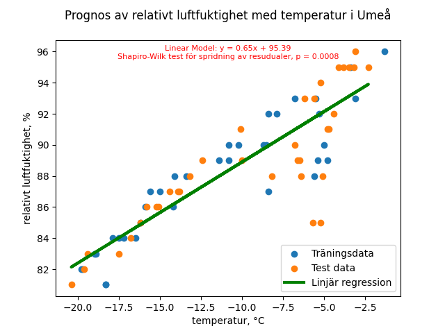
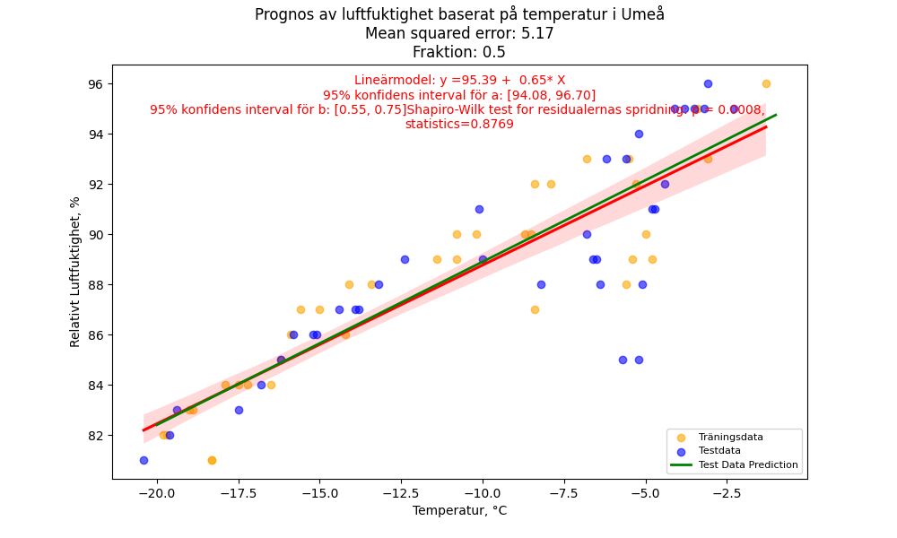
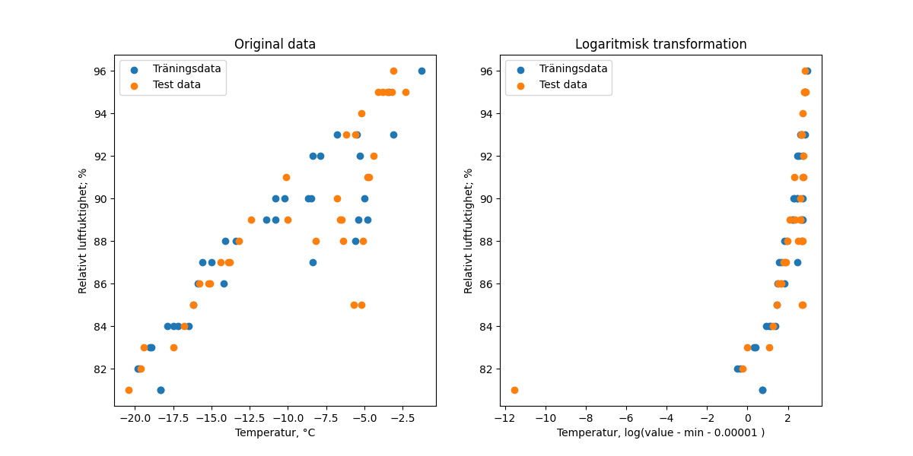

# PROJECT RAPPRORT for kurs Matematisk Modelering MA1487 HT24
*Olga Egorova, oleg22*

## Introduction

I projektet förväntas vi att plocka data från en open API, beskriva hämtade data och berbeta de med olika statistiska metoder.
Datamängder för projektet hämtas från SMHI [Open Data API Docs - Meteorological Observations](https://opendata.smhi.se/apidocs/metobs/index.html). Detta API tillhandahåller meteorologiska data som beskriver väderförändringar på olika platser i Sverige. API:et erbjuder flera olika typer av mätningar, inklusive temperatur (parameter 1) och relativ luftfuktighet (parameter 6). Dessa parametrar kan användas för att, till exempel, förstå klimatförhållanden och variationer över tid.

För projektet ville jag hämta begränsad mängd av data. Eftersom temperaturs och relativt luftfuktighet mäts varje timme, data från sista tre dygn ska innehålla 72 mätningar. Det mängd av data är oversiktligt och tillräckligt stor för vlera statistiska metoder. Därför välde jag dessa parametrar för analys. I arbete används data från tre meteorologiska stationer: Halmstad flygplats, Uppsala Flygplats och Umeå Flygplats. Stationer välds eftersom båda välda parametrar finns att hämta i API. Flera andra stationer hade inte data för dessa parametrar.

Temperaturen mäts i grader Celsius (°C), medan relativ luftfuktighet anges i procent (%). Genom att använda dessa data kan jag utföra olika typer av statistiska analyser, inklusive visualiseringar av frekvensfördelningar, beräkningar av medelvärden och standardavvikelser, samt jämförelser mellan stationer och parametrar. Detta arbete syftar till att demonstrera hur statistiska metoder kan användas för att bearbeta och tolka meteorologiska data.


## Uppgift 1. Databeskrivning
All kod som jag använder för att hämta och bearbeta data finns i [GitHub](https://github.com/OlganeOlga/MathMod/tree/master/get_dynam_data). För att hämta en ny dataset, skaffa alla tabeller och figurer tillräckligt att använda fill [´ALL_CODE.py´](ALL_CODE.py)
Datamängder plockas med följande kod:

```python
    import json

    # This part i inactivated because i am working with downloaded data
    # Dowloads data from three stations and for two parameters
    for key in PARAMS.keys():
        for station, id in STATIONS.items():
            data_url = f'https://opendata-download-metobs.smhi.se/api/version/1.0/parameter/{key}/station/{id}/period/{PERIOD}/data.json'
            response = requests.get(data_url)
            response.raise_for_status()  # Check if the request succeeded
            
            result = json.loads(response.content)
            save_path = f'data/{id}_{key}.json'
            with open(save_path, "w", encoding="utf-8") as file:
                json.dump(result, file, indent=4, ensure_ascii=False)
```

Som resultat genereras en JSON-fil för varje kombination av station och parameter. Varje fil innehåller över 2500 mätpunkter, vilket ger en omfattande datamängd för analys. För statistisk bearbetning används data från de senaste 72 timmarna. Urvalet av data görs med hjälp av följande kod:

```python

    import datetime
    import json
    import pytz
    import numpy as np

    # variables
    STATIONS = {'Halmstad flygplats': 62410, 'Uppsala Flygplats': 97530, 'Umeå Flygplats': 140480}
    # parameters to download (parameter_id:parameter_name)
    PARAMS = {1:["TEMPERATUR", "°C"], 6:["LUFTFUKTIGHET", "%"]}
    # Extract the required period (three days) from downloaded data
    measured_points = 72  # Number of points to include
    three_days = {}
    data_rows = []

    # Process data for each parameter and station
    for param_id, parameter in PARAMS.items():
        three_d_station = {}
        for name, station_id in STATIONS.items():
            file_path = f"data/{station_id}_{param_id}.json"
            with open(file_path, 'r') as file:
                data = json.load(file)

            # Sort data by timestamp and select the last N points
            sorted_data = sorted(
                data.get("value", []),
                key=lambda x: datetime.fromtimestamp(x["date"] / 1000, tz=pytz.timezone("Europe/Stockholm"))
            )[-measured_points:]

            # Prepare station data and append rows for further processing
            stat_set = {}
            for item in sorted_data:
                new_value = float(item['value']) if item['quality'] in ['G', 'Y'] else np.nan
                stat_set[item['date']] = new_value
                data_rows.append({
                    'time': datetime.fromtimestamp(item['date'] / 1000, tz=pytz.timezone("Europe/Stockholm")),
                    'station_name': name,
                    'parameter': PARAMS[param_id][0],
                    'value': new_value
                })
            three_d_station[name] = stat_set
        three_days[param_id] = three_d_station
```
Det skaffas två objekt med samma innhåll:
1. ´tree-days´ - En nästlad ordbok (dictionary) som innehåller filtrerad och sorterad data för de senaste 72 timmarna för varje parameter och station. Strukturen ser ut så här:
```python
    {
        param_id: {  # Parameterens ID
            station_name: {  # Stationens namn
                timestamp: värde,  # Tidsstämpel och tillhörande mätvärde
                ...
            },
            ...
        },
        ...
    }
```
Nycklar: param_id (parameter-ID) och station_name (stationens namn).
Värden: För varje station skapas en ordbok där nyckeln är en tidsstämpel och värdet är ett numeriskt mätvärde (eller numpy.nan om kvaliteten inte är godkänd). Det objekt används i flesta fall.
2. ´data_rows` - En lista med rader där varje rad är en ordbok med information om en specifik mätpunkt. Strukturen ser ut så här:
[
    {
        'time': datetime-objekt,  # Tidsstämpel som datetime-objekt
        'station_name': 'stationens namn',  # Namn på mätstationen
        'parameter': 'parameterens namn',  # Parameterns namn (t.ex. temperatur eller luftfuktighet)
        'value': numeriskt värde  # Mätvärde eller numpy.nan
    },
    ...
]
Sista objektet är lättare att omvandla till pandas <DataFtame> objekt. För att lättare operera med data jag skaffar också kombinerad <DataFrame> objekt ´df_three´.

'''
    import utils # some funktionalitet
    
    # Convert the list of dictionaries into a pandas DataFrame objekt
    df_three = pd.DataFrame(data_rows)
    df_three.columns.str.replace(' ', '\n')

    # save to markdown file to be able sow in the presentation
    utils.save_to_mdfile(df_three, 'dataframe.md', 'statistics')
'''

Urval av hämtade datamängd presenteras i Tabel 1. Fullständigt tabell finns på [GitHub](statistics/dataframe.md)

#### Tabel 1. [Sammansätta data](statistics/dataframe.md)

|     | time                      | station_name       | parameter     |   value |
|----:|:--------------------------|:-------------------|:--------------|--------:|
|   0 | 2024-12-15 18:00:00+01:00 | Halmstad flygplats | TEMPERATUR    |     7.8 |
|   1 | 2024-12-15 19:00:00+01:00 | Halmstad flygplats | TEMPERATUR    |     8.1 |
.............
| 132 | 2024-12-18 06:00:00+01:00 | Uppsala Flygplats  | TEMPERATUR    |    -3.7 |
| 133 | 2024-12-18 07:00:00+01:00 | Uppsala Flygplats  | TEMPERATUR    |    -3.2 |
| 134 | 2024-12-18 08:00:00+01:00 | Uppsala Flygplats  | TEMPERATUR    |    -2.7 |
...............
| 214 | 2024-12-18 16:00:00+01:00 | Umeå Flygplats     | TEMPERATUR    |    -3.4 |
| 215 | 2024-12-18 17:00:00+01:00 | Umeå Flygplats     | TEMPERATUR    |    -3.1 |
| 216 | 2024-12-15 18:00:00+01:00 | Halmstad flygplats | LUFTFUKTIGHET |    98   |
| 217 | 2024-12-15 19:00:00+01:00 | Halmstad flygplats | LUFTFUKTIGHET |    95   |
...............
| 429 | 2024-12-18 15:00:00+01:00 | Umeå Flygplats     | LUFTFUKTIGHET |    95   |
| 430 | 2024-12-18 16:00:00+01:00 | Umeå Flygplats     | LUFTFUKTIGHET |    95   |
| 431 | 2024-12-18 17:00:00+01:00 | Umeå Flygplats     | LUFTFUKTIGHET |    96   |

För att testa om vissa tidpunkter pa en av stationer saknar av mätningar används följande kode:

'''
    # Count NaN values per station_name and parameter
    nan_counts = df_three.groupby(['station_name', 'parameter'])['value'].apply(lambda x: x.isna().sum()).reset_index()

    # Give name for columns
    nan_counts.columns = ['station_name', 'parameter', 'Missing values']
    utils.save_to_mdfile(nan_counts, "nan_counts.md", "statistics")

'''
Resultat visar att inga mätningar saknas (Tabel 2.):

#### Tabel 2. [Missade data för alla parameter: ](statistics/nan_count.md)
|    | station_name       | parameter     |   Missing values |
|---:|:-------------------|:--------------|-----------------:|
|  0 | Halmstad flygplats | LUFTFUKTIGHET |                0 |
|  1 | Halmstad flygplats | TEMPERATUR    |                0 |
|  2 | Umeå Flygplats     | LUFTFUKTIGHET |                0 |
|  3 | Umeå Flygplats     | TEMPERATUR    |                0 |
|  4 | Uppsala Flygplats  | LUFTFUKTIGHET |                0 |
|  5 | Uppsala Flygplats  | TEMPERATUR    |                0 |


## Uppgift 2. Beskrivande statistik 

För att snabbt räkna ut statistiska egenskaper jag använder [describe()](https://pandas.pydata.org/pandas-docs/stable/reference/api/pandas.DataFrame.describe.html) metod fär pandas <DateFrame> objekt.

'''
    descriptive_stats = df_three.groupby(['station_name', 'parameter'])['value'].describe()
'''

Resultat presenterad i Tabel 3:

#### Tabell 3. [Beskrivande statistik för alla stationer och parametrar](statistics/descriptive_stats.md)
<div style="font-size: 8px;">

|      staion, parameter, enheter       |   count |   mean |   std |   min |    25% |    50% |   75% |   max |
|:--------------------------------------|--------:|-------:|------:|------:|-------:|-------:|------:|------:|
| Halmstad flygplats, LUFTFUKTIGHET, %  |      72 |  91.47 |  5.98 |  75   |  90    |  93    | 96    |  99   |
| Halmstad flygplats, TEMPERATUR °C     |      72 |   6.91 |  0.93 |   4.4 |   6.38 |   7    |  7.43 |   8.9 |
| Umeå Flygplats, LUFTFUKTIGHET, %      |      72 |  88.38 |  4.1  |  81   |  85    |  88    | 91.25 |  96   |
| Umeå Flygplats, TEMPERATUR, °C        |      72 | -10.61 |  5.68 | -20.4 | -15.82 | -10.05 | -5.38 |  -1.3 |
| Uppsala Flygplats, LUFTFUKTIGHET, %   |      72 |  78.01 | 14.14 |  57   |  64    |  77.5  | 87.25 | 100   |
| Uppsala Flygplats, TEMPERATUR, °C     |      72 |   1.27 |  2.48 |  -4.7 |   0.18 |   1.9  |  2.72 |   6.6 |
</div>

Tabellen  att alla stationer har 72 mätningspunkter för båda parameter. Medelvärde är oftast inte avvikar mycket från medianen med undentag för temperatur i Umeå. Första och tredje kvartiler avstar ganska lika mycket från median, men minimala och maksimala värde avstar inte lika mycket från median.

Det är svårt att säga om data är normalfördelat enbart från resultater av tabellen. Jag skaffar därför plottar som visar hur data fördelade.

Beskrivande statistik kan visualiseras med hjälp av ladogrammar, som visar medelvärde, kvariler, 95% spridningen och avvikande värde i urvalet.

## Uppgift 3. Beskrivande plottar
Följande kode skaffar ladogrammer för varje station ohc parameter. Jag välde att göra Shapiro-Wilk test och visualisera resultat på ladogrammer, ([Figur 2.](Figur 2.)).
[Shapiro-Wilk test](https://academic.oup.com/biomet/article-abstract/52/3-4/591/336553?redirectedFrom=fulltext) en av mest användda tester för att jamföra urvalet med normalfordelninen. p-värde mindre än 5% tillåter säga att det är ossannolikt att urvalets data normalfördelade. 

```python

    # Arrayer to itirate through
    stations = df_three['station_name'].unique()
    parameters = df_three['parameter'].unique()

    # Set up the figure
    fig, axes = plt.subplots(2, 3, figsize=(12, 4 * 2))  # 2 rows, 3 columns

    # Array to save reultats of the Shapiro-Wilk test
    ShapiroW = []
    # Loop over stations and parameters
    for i, parameter in enumerate(parameters):
        for j, station in enumerate(stations):
            data_filtered = df_three[(df_three['station_name'] == station) & (df_three['parameter'] == parameter)]
            
            # Perform Shwpiro-Wilk normality test
            stat, p_value = sci.shapiro(data_filtered['value'])
            ShapiroW.append({
                'Station': station,
                'Parameter': parameter,
                'Shapiro-Wilk Statistic': round(stat, 5),
                'P-value': round(p_value, 5),
                'Normal Distribution (p > 0.05)': 'Yes' if p_value > 0.05 else 'No'
            })
            ax = axes[i, j]
            
            # the boxplot
            sns.boxplot(
                ax=ax,
                data=data_filtered,
                x='station_name',  # Same station on x-axis
                y='value',
                palette=[COLORS[j]],  # Assign unique color for the station
                width=0.3,
                dodge=False
            )
            #ax.set_title(f"{station} - {parameter}", fontsize=8)
            ax.set_ylabel(f"{parameter}, {'°C' if parameter == 'TEMPERATUR' else '%'}", fontsize=8)
            # Remove the x-axis label
            ax.set_xlabel("")

            # Annotate p-value on the plot
            ax.text(
                0.8, 0.13,  # Position: center-top of the plot
                f"p={p_value:.5f}",
                transform=ax.transAxes,
                fontsize=10,
                ha='center',
                color='red' if p_value < 0.05 else 'black'
            )
    plt.suptitle("Databeskrivning med ladogrammar", fontsize=16)

    # Adjust layout to make space for the title
    plt.tight_layout(rect=[0, 0, 1, 0.95]) 

    plt.savefig('img/box_plot/all.png')
    plt.show()

```

#### Figur 1. 
##### Förklaring till Figur 2.
Figuren visar boxplottar för olika stationer och parametrar. De parametrar som visas och respectiva stationer skriven under varje subplot. Motsvarande enheter anges med etiketter till y-axes. Boxplottarna visar fördelningen av värden för varje station, där den horisontal linjen representerar medianen, boxarna visar det interkvartila intervallet (IQR) och morrhåren sträcker sig till minimi- och maximivärdena inom 1,5 * IQR. Små sirklar visar avvikande värde.
För varje boxplott anges ett resultat från Shapiro-Wilk-testetm, den hjälper att bedöma om data följer en normalfördelning. Ett p-värde under 0,05 indikerar att data inte följer en normalfördelning, och detta markeras med rött i diagrammet.

#### Tabell 4. Resultater av [Shapiro-Wilk test](statistics/shapiro_wilk.md)


| Station            | Parameter     |   Shapiro-Wilk Statistic |   P-value | Normal Distribution (p > 0.05)   |
|:-------------------|:--------------|-------------------------:|----------:|:---------------------------------|
| Halmstad flygplats | LUFTFUKTIGHET |                    0.884 |     0     | No                               |
| Halmstad flygplats | TEMPERATUR    |                    0.964 |     0.038 | No                               |
| Umeå Flygplats     | LUFTFUKTIGHET |                    0.969 |     0.07  | Yes                              |
| Umeå Flygplats     | TEMPERATUR    |                    0.92  |     0     | No                               |
| Uppsala Flygplats  | LUFTFUKTIGHET |                    0.918 |     0     | No                               |
| Uppsala Flygplats  | TEMPERATUR    |                    0.944 |     0.003 | No                               |

*Med dessa plottar och Shapiro-Wilk test testar jag nulhypotes: att data är noirmalfördelad.*
Ldogrammar och Shapiro-Wilk test för normality tillåtar förkasta nulhypotes om att temperatur spridning är normal fördelad. Sannolikheten att nulhypotes stämmer är mindre än 5% och därmed för alla tre platsar och därmed är sannolikhet för typ II fel (att felaktigt förkasta null hupotes) är ganska liten.
Samma påstående stämmer för relativt lyft fuktighet med undantag för relativt luftfuktighet i Umeå flygplats, där sannolikhet att null hypotes stämmer är mera än 5%, nämlgen 7%.

Fördelning av data i urvalet kan visualiseras även med stapeldiagram. Figur med stapeldiagammar skapas med följande koden:

'''
    plt.figure(figsize=(8, 6)) # initiate figure
    # Prepare the custom blue square legend handle
    text = f"Blue color shows samples distribution"
    blue_square = Line2D([0], [0], marker='s', color='w', markerfacecolor='blue', markersize=8, label=text)

    # Prepare the legend for the normal distribution
    normal_dist_line = Line2D([0], [0], color='orange', lw=2, label="Normal Distribution")

    normal_dist_added = False # variable to chose what norm dist line vill be shown in the legend
    # Iterate through all stations and parameters
    for i, station in enumerate(stations):
        for j, parameter in enumerate(parameters):
            # filter data for each station and parameter
            data = df_three[(df_three['station_name'] == station) & (df_three['parameter'] == parameter)]

            # Subplot indexering: 3 rows for 3 stations and 2 columns for 2 parameters
            plt.subplot(3, 2, i * len(parameters) + j + 1) 
            
            sns.histplot(data['value'], kde=True, bins=24, color="blue", edgecolor="black")
                    
            # Calculate the mean and standard deviation
            mean = data['value'].mean()
            std_dev = data['value'].std()

            # Generate x values for normal distribution (range around the data's values)
            x = np.linspace(data['value'].min(), data['value'].max(), 100)
            
            # Calculate the normal distribution values (PDF)
            y = sci.norm.pdf(x, mean, std_dev)
            # Add normal distribution with te same parameters to the subplot
            plt.plot(x, y * len(data) * (x[1] - x[0]), color='orange')
            
            # add title and axes
            plt.title(f"{station}", fontsize=10)
            # Conditionally set the xlabel depending on the parameter
            if parameter == 'TEMPERATUR':
                plt.xlabel(f"{parameter.lower()} (°C)")
            else:
                plt.xlabel(f"{parameter.lower()} (%)")
            
            plt.ylabel("Frekvens")
    # Create a global legend outside the subplots (top)
    fig = plt.gcf()  # Get the current figure

    fig.legend(handles=[blue_square, normal_dist_line], loc='upper center', bbox_to_anchor=(0.5, 0.99), ncol=2, fontsize='small')

    plt.tight_layout()
    plt.subplots_adjust(top=0.85)  # Adjust top margin to make room for the legend

    # Save and show the plot
    plt.savefig("img/frekvenser/alla.png")
'''

Grafiska fördelningar visas i Figur 2.


##### Förklaring till Figur 2.
Den här figuren visualiserar frekvensfördelningen av temperatur- och relativ luftfuktighetsdata från flera stationer i Sverige, inklusive Halmstad Flygplats, Uppsala Flygplats och Umeå Flygplats. Fördelningen visas som histogram med Kernel Density Estimation (KDE), och varje subplot motsvarar en kombination av station och parameter.De blå staplarna representerar frekvensfördelningen av mätningarna, där varje stapel representerar ett specifikt värdeintervall. Blå linjän visar Kernel density estimation, eller den uppskattade sannolikhetsdensiteten för mätvärdena. Normalfördelningskurvan är en orange linje. Denna kurva beräknas med hjälp av medelvärdet och standardavvikelsen för värdena i datasetet för varje station och parameter. Normalfördelningen läggs till för att visuellt jämföra hur den faktiska datadistributionen överensstämmer med den teoretiska normalfördelningen.


Figurer 1 och 2 visar att spridningen i alla datamängder avviker från Normalspridningen. Shapiro-Wilk dock säger att dataspridning av relativt luftfuktighet i Umeå närmar sig mest till normalt. Stapelldiagrammar visar också att relativt luftfuktighet förändras inte likadant med temperaturförändring vid varje station. Här ifrån tar jag slutsatsen att det är inte korrekt att utföra statistiska tester på sammansätta data från alla stationer.

### Q_Q plottar
Det finns ett annat sät att visualisera avvikelse från eller liknande till normalfördelning, nämligen [kvantil_kvantil plot](https://pubmed.ncbi.nlm.nih.gov/5661047/). Q-Q plottar skaffas ed förljande koden:

```python
   
    fig, axes = plt.subplots(2, 3, figsize=(10, 3 * 2))
    # Loopa through all stations and parameters
    for i, station in enumerate(stations):
        for j, parameter in enumerate(parameters):
            # Filter for station and oarameter
            data = df_three[(df_three['station_name'] == station) & (df_three['parameter'] == parameter)]
            numeric_data = data['value'].dropna()
            # Create Q_Q plots
            ax = axes[j, i]
            sci.probplot(numeric_data, dist="norm", plot=ax)
            ax.set_ylabel(f"{'temperatur, °C' if parameter == 'TEMPERATUR' else 'humidity, %'}", fontsize=8)
            # Add titel
            ax.set_title(f"Q-Q plot: {station} - {parameter}", fontsize=8)
            ax.get_lines()[1].set_color('red')  # Give lene for the 
    plt.tight_layout()
    plt.savefig('img/q_q_plot/all.png')
    plt.close()

```

REsultat visas på Figur 3.

#### Figur 3. 
##### Förklaring av Quantile-Quantile fördelning plottar

 På plottar jämförs dataset från olika stationer och parametrar mot den teoretiska normalfördelningen. En Q-Q plot (Quantile-Quantile plot) jämför de empiriska kvantilerna från den faktiska datan med de teoretiska kvantilerna från en normalfördelning. Syftet med denna figur är att visuellt bedöma hur väl datan följer en normalfördelning. Varje plot visar fördelningen av en dataset. I På X-axeln visas normafördelnings kvantiler, på Y-axeln visas kvantiler från respektiv datamängd (Tabel 3[a](### Tabel 3a)[b][### Tabel 3b])

Tolkning av figuren:
- **Om punkterna ligger nära en rak linje**: Detta tyder på att datan är nära en normalfördelning.
- **Om punkterna avviker från linjen**:
  - **Om punkterna böjer sig uppåt vid svansarna**: Detta kan indikera att datan har för mycket extrema värden, vilket tyder på en tyngre svans än normalfördelningen (t.ex. en t-fördelning).
  - **Om punkterna böjer sig nedåt vid svansarna**: Detta kan tyda på att datan har för få extrema värden och inte har lika många extremvärden som en normalfördelning.
  - **Om punkterna är ojämnt fördelade eller böjer sig i mitten**: Detta kan indikera en snedvridning (skewness) i datan, vilket innebär att den inte är symmetrisk.

Denna typ av figur används för att snabbt bedöma om datan följer en normalfördelning, vilket kan vara användbart i statistiska tester eller när du ska välja lämpliga modeller för analysen.

Liksom tidigare testar visar figur att närmast till normalfördelningen är data från relativt luftfuktighet i Umeå flygplats.

Jag försökte ta bort mest avvikande värde från Umeå dataset (i example kod kastas de 5 högsta och 2 lagsta värde) för att se om det hjälper att nå normalfördelning.

Här är exampel kod:
```python
    # Get data with removed titestips for the lowers temperatur
    name = 'Umeå Flygplats'
    # Filter data for the specific station
    station_data = df_three[df_three['station_name'] == name]

    # Number of lowest temperature data points to remove
    to_remove = 4
    changed_by ='TEMPERATUR'
    # Find the rows with the lowest temperature values
    param_data = station_data[station_data['parameter'] == changed_by]
    lowest_param = param_data.nsmallest(to_remove, 'value')  # Rows with the lowest parparameter values
    #all_param = lowest_param.nlargest(1, 'value')
    all_param = lowest_param
    all_param_timestamps = lowest_param['time'].tolist()  # Extract the timestamps as a list

    # Filter out rows with the lowest parameter values timestamps across all parameters
    filtered_data = station_data[~station_data['time'].isin(all_param_timestamps)]  # Use .isin() for filtering

    # Plot the filtered data
    fig, axes = plt.subplots(1, 2, figsize=(8, 4))
    for i, value in enumerate(PARAMS.values()):
        ax = axes[i]
        # Filter the parameter-specific data
        param_data = filtered_data[filtered_data['parameter'] == value[0]]
        stat, prob = sci.shapiro(param_data['value'])
        numeric_data = param_data['value'].dropna()

        # Generate Q-Q plot
        sci.probplot(numeric_data, dist="norm", plot=ax)
        ax.set_ylabel(f"{'temperatur, °C' if value[0] == 'TEMPERATUR' else 'humidity, %'}", fontsize=8)
        ax.set_xlabel("teoretiska quantiler")
        axes[i].text(
            0.1, 0.9, 
            f"Shapiro_Wilk test: statistik={stat:.2f},\nsannolikhet för normalspridning={prob:.2f}", 
            color="red", fontsize=5,
            transform=ax.transAxes, 
            verticalalignment='top', 
            bbox=dict(facecolor='white', alpha=0.5)
        )
        # Clear the title
        ax.set_title(value[0].lower())
        # Add line
        ax.get_lines()[1].set_color('red')  # Color theoretical quantile line red
    plt.suptitle(f"Q-Q plot: {name} utan {to_remove} tidpunkter\nmed de lägsta {changed_by.lower()} värder", fontsize=12)
    plt.tight_layout()
    plt.savefig(f'img/q_q_plot/{re.sub("(?i)"+re.escape("flygplats"), "", name)}_{changed_by.lower()}_min_{to_remove}_outliers.png')
    plt.show()
    plt.close()
```
I Figur 3a visas resultat.
#### Figur 3a. 


Figur 3a visar om extrema värde tas bort, då närmar dataset sig normalfördelningen. Jag tycker dock att fördelninen förändras inte tillräckligt mycket. Därför fortätter jag analysera öförändrade dataset.

## Uppgift 4: Linjär regression

För att ser med vilka data ska jag arbeta vill jag först titta på hur data korrelerrar med varandra. Därför skaffar jag några plottar, som visas på Figur 4.

#### Figur 4a. 

Figuren visar att temperatur och luftfuktighet i Umeå flugplats korrelerar, men det kan inte sägas att luftfuktighet och temperatur korrelerar i två andra stationer. Plot var skaffat med förljande kod:

```python
    # Pivote three_days
    pivote_df = df_three.pivot_table(index=['time', 'station_name'], columns='parameter', values='value').reset_index()

    # create paired plot
    sns.pairplot(pivote_df, hue='station_name')
    plt.subplots_adjust(top=0.9)
    plt.suptitle("Parvisa relationer mellan temperatur och luftfuktighet", fontsize=10, y=0.95)
    plt.savefig("img/correlation/param_param.png")
    plt.show()
    plt.close()
```

Jag skaffar även ett annat plot, som visar mera detaljer:

```python
    # Pairplot 
    fig = sns.pairplot(combined_data, height=1.8, diag_kind='kde')
    # Adjust igont size and axis
    for ax in fig.axes.flatten():
        # Get current x and y axis labels
        xlabel = ax.get_xlabel()
        ylabel = ax.get_ylabel()

        xlabel = re.sub(r'(?i)flygplats', '', xlabel).strip()  # Remove "flygplats" (case-insensitive)
        xlabel = xlabel.replace("TEMPERATUR_", "°C, TEMP_").strip()  # Replace "TEMPERATUR_" with "TEMP_"
        xlabel = xlabel.replace("LUFTFUKTIGHET_", "%, FUKT_").strip()  # Replace "LUFTFUKTIGHET_" with "FUKT_"
        
        ylabel = re.sub(r'(?i)flygplats', '', ylabel).strip()  # Remove "flygplats" (case-insensitive)
        ylabel = ylabel.replace("TEMPERATUR_", "°C, TEMP_").strip()  # Replace "TEMPERATUR_" with "TEMP_"
        ylabel = ylabel.replace("LUFTFUKTIGHET_", "%, FUKT_").strip()  # Replace "LUFTFUKTIGHET_" with "FUKT_"
        
        # Set the modified labels with font size
        ax.set_xlabel(xlabel, fontsize=6)
        ax.set_ylabel(ylabel, fontsize=6)
        
        ax.set_ylabel(ylabel.replace("LUFTFUKTIGHET_", "%, FUKT_").strip(), fontsize=6)
        
        # Set font size for tick labels
        ax.tick_params(axis='x', labelsize=5)  # X-axis tick labels
        ax.tick_params(axis='y', labelsize=5)  # Y-axis tick labels

    plt.suptitle("Pairwise Relationships for Parameters and Stations", y=0.99, fontsize=16)  # Title for the plot
    plt.subplots_adjust(hspace=0.2, wspace=0.2, top=0.9) # Ajust spase between subplots
    plt.savefig('img/correlation/all_pairwise_relationships.png')
    plt.show()
    plt.close()
```

#### Figur 4b. 

Detta plot visar igen, att det kan finnas direkt samband mellan relativt luftfuktighet och temperatur i Umeå.
Jag skapar också matris som visar hur korrelerrar en parameter från en station med alla andra parameter-station kombinationer.

```python
    # Calculate the correlation matrix
    correlation_matrix = combined_data.corr()

    # Plot the heatmap
    plt.figure(figsize=(12, 10))
    ax = sns.heatmap(
        correlation_matrix, 
        annot=True,  # Avoid cluttering with too many annotations
        cmap=LinearSegmentedColormap.from_list("CustomCmap", COLORS, N=256), 
        cbar=True
    )
    # Adjust font sizes for station names
    ax.tick_params(axis='x', labelsize=8)
    ax.tick_params(axis='y', labelsize=8)
    plt.title("Korrelationsmatris för alla parametrar och stationer", fontsize=14)
    plt.tight_layout()
    plt.savefig('img/correlations/all_correlations.png')
    plt.show()
    plt.close()

```
#### Figur 4c. 
##### Förklaring till Figur 4c.
I figur visas korrelations koeffitienter mellan olika dataset. På axlar visas olika parameter-station kombiantioner. Samma kombinatiner visas på båda axlarna. Korrelationskoefitientar mellan parar visas med text i färgade kvadrater. Färgskala visas till höger. Färgskalan hjälper till visuelt bedömningen.

Korrelationmatrisen visar samma som två figurer innan (Figur 4a och Figur 4b).Ttydlig korrelation finns bara mellan relativt luftfuktighet och temperatur i Umeå flugplats. Därför väljer jag att utförska samband mellan relativt luftfuktighet och temperatur bara i Umeå vidare.

Jag skaffar regressions modell med hjälp av maskinlearning. 50% av data används som tanings dataset de resterande 50% används som testdataset.

```python
    # Get training ang testing datasets
    fraktion = 0.5
    train = combined_data.sample(frac=fraktion, random_state=1)
    test = combined_data.drop(train.index)

    # # Extract X (independent variable) and y (dependent variable) from the dataframe
    X_train = train[column_name1].values.reshape(-1, 1)  # Reshape for a single feature
    y_train = train[column_name2].values  # Dependent variable (y)
    X_test = test[column_name1].values.reshape(-1, 1)  # Reshape for a single feature
    y_test = test[column_name2].values  # Dependent variable (y)


    model = LinearRegression().fit(X_train, y_train)
    pred = model.predict(X_test)

    # Räkna ut MSE
    mse = np.mean((pred - y_test)**2)
    linear_slope = model.coef_[0]
    linear_intercept = model.intercept_

    # Add linear regression parameters to the plot
    plt.text(0.5, 0.95, f'Linear Model: y = {linear_slope:.2f}x + {linear_intercept:.2f}',
            ha='center', va='center', transform=plt.gca().transAxes, fontsize=12, color='red')
    # Visulisera prediktioner
    plt.scatter(X_train, y_train, label='Träningsdata')
    plt.scatter(X_test, y_test, label='Test data')
    plt.plot(X_test, pred, label='Linjär regression', color='g', linewidth=3)
    plt.legend()
    plt.title(f"Prognos av relativt luftfuktighet med temperatur i Umeå\nMean squared error: {mse}" + 
            f"\nFraktion: {fraktion}")
    plt.xlabel("temperatur, °C")
    plt.ylabel("relativt luftfuktighet, %")
    plt.savefig(f'img/regression/regr_prediction_Umea_temp_luft_{fraktion}.png')
    plt.show()
 
```
#### Figur 5a. 

##### Förklaring till figuren 5a. 
Figuren visar den linjära regressionsmodellen som förutsäger relativ luftfuktighet på Umeå flygplats på grund av temperatur. X-axeln visar temperatur i Celciumgrader, Y-axeln visar relativ luftfuktighet i procent. Orange punkter visar data som använts för att ta fram prediktionsmodellen, blå punkter visar data som använts för att testa prediktionsmodellen. Röd linje representerar prediktionsmodellen och grön linje representerar den modell som skulle erhållas med testdataset. Ekvationen för prediktionsmodellen visas i röd text. 


```python
    # Fraction of data to train
    fraktion = 0.5
    train = combined_data.sample(frac=fraktion, random_state=1)
    test = combined_data.drop(train.index)

    # Name of columns
    column_name1 = "TEMPERATUR_Umeå Flygplats"
    column_name2 = "LUFTFUKTIGHET_Umeå Flygplats"

    # Extract X (independent variable) and y (dependent variable)
    X_train = train[column_name1].values.reshape(-1, 1)
    y_train = train[column_name2].values
    X_test = test[column_name1].values.reshape(-1, 1)
    y_test = test[column_name2].values

    # Trainings model
    model = LinearRegression().fit(X_train, y_train)
    pred = model.predict(X_test)

    # MSE of test data
    mse = np.mean((pred - y_test) ** 2)
    linear_slope = model.coef_[0]
    linear_intercept = model.intercept_

    # Use statsmodel for confidens interval
    X_train_with_const = sm.add_constant(X_train)  # Lägg till konstant för intercept
    ols_model = sm.OLS(y_train, X_train_with_const).fit()
    conf_int_params = ols_model.conf_int(alpha=0.05)  # 95% konfidensintervall

    # calculate confidens interval
    intercept_ci = conf_int_params[0]  # Första raden: Intercept
    slope_ci = conf_int_params[1]  # Andra raden: Lutning

    # Print regression parameters and confidens interval
    print(f"Regression Equation: y = {linear_intercept:.2f} + {linear_slope:.2f} * X")
    print(f"95% Confidence Interval for Intercept (a): {intercept_ci}")
    print(f"95% Confidence Interval for Slope (b): {slope_ci}")
    print(f"Mean Squared Error (MSE): {mse:.2f}")

    plt.figure(figsize=(10, 6))
    # Train data
    plt.scatter(X_train, y_train, color="orange", label='Träningsdata', alpha=0.6)
    # Test data
    plt.scatter(X_test, y_test, color="blue", label='Testdata', alpha=0.6)
    # Title
    sns.regplot(x=column_name1, y=column_name2, data=combined_data, scatter=False, 
                line_kws={'color': 'red', 'label': f'Y = {linear_slope:.2f}X + {linear_intercept:.2f}'}, ci=95)
    # Regression line for predictions (testdata)
    y_pred = model.predict(X_test)
    plt.plot(X_test, y_pred, color='green', label='Test Data Prediction', linewidth=2)
    # show Regression equation and confidence interval
    plt.text(0.5, 0.89, 
            f'Linear Model: y = {linear_slope:.2f}x + {linear_intercept:.2f}\n'
            f'95% CI for Intercept: [{intercept_ci[0]:.2f}, {intercept_ci[1]:.2f}]\n'
            f'95% CI for Slope: [{slope_ci[0]:.2f}, {slope_ci[1]:.2f}]', 
            ha='center', va='center', transform=plt.gca().transAxes, fontsize=10, color='red')
    plt.title(f"Prognos av luftfuktighet baserat på temperatur i Umeå\nMean squared error: {mse:.2f}\nFraktion: {fraktion}")
    plt.xlabel("Temperatur, °C")
    plt.ylabel("Relativt Luftfuktighet, %")
    plt.legend(loc='best')
    plt.savefig(f'img/regression/Conf_int_regr_prediction_Umea_temp_luft.png')
    plt.show()
```
#### Figur 5b. 
##### Forklaring till figuren 5b.
Figuren visar den linjära regressionsmodellen som förutsäger relativ luftfuktighet på Umeå flygplats på grund av temperatur. X-axeln visar temperatur i Celciumgrader, Y-axeln visar relativ luftfuktighet i procent. Orange punkter visar data som använts för att ta fram prediktionsmodellen, blå punkter visar data som använts för att testa prediktionsmodellen. Röd linje representerar prediktionsmodellen och grön linje representerar den modell som skulle erhållas med testdataset. Ekvationen för prediktionsmodellen visas i röd text. Grön linja visar korrelation model som skulle skappas om test dataset skulle användas i stället av trainings dataset.
Jag räknar ut residualer och visa de på plottar:

```python
    # Calculate residuals of test data
    residuals = pred - y_test
    # Calculate standarddeviation of residuals
    std_residual = np.std(residuals)
    stat, p = sci.shapiro(residuals) # test for normal distribution
    # Visualise residuals
    plt.scatter(X_test, residuals)
    plt.axhline(0, color='r', linestyle='--')
    plt.title("Residualer av relativt luftfuktighet i Umeå")
    plt.xlabel("temperatur i Umeå, °C")
    plt.ylabel("Residualer av relativt luftfuktighet, %")
    text = (f"Standard avvikelse för residualer: {std_residual:.2f} %\n"
            f"Shapiro-Wilk test for residualernas spridning: p = {p:.3f}, \nstatistics={stat:.3f}\n"
            f"Som visar att resudualernas spridning kan inte bearbetas som normal.")
    # Place text at a specific location in data coordinates
    plt.text(-20.0, 4.5, text, 
            color="green", fontsize=8, ha='left', va='bottom')
    plt.savefig('img/regression/residuals_temp_fukt_UME.png')
    #plt.show()
    plt.close()

        # Show histogram av residualen för test data
    plt.hist(residuals, bins=24, edgecolor='white', alpha=1.0)
    plt.title("Histogram av residualer av luftfuktighet i Umeå", fontsize=10)
    plt.xlabel("Residuals")
    plt.ylabel("Frekvens")
    plt.savefig('img/regression/residuals_hist_temp_fukt_UME.png')
    #plt.show()
    plt.close() 
```

Resultat visas på Figur 6a och 6b:
#### Figur 6a.

#### Figur 6b. 
Båda figurer visar att fordelningen är inte normal. Det kan betyda att variablerna är beroende av varandra.

## Uppgift 5: Transformera data

Jag testar om logoritmisk transformation av temperatur skulle ge bättre modellen. Temeratur i Umeå har negativa värde. För att göra logaritmisk transormation behöver jag höja alla temperaturvärde, så att värde blir högrä än 0.

```python
    # Log transformation
    # I cannot use direct log-transformaton due to negative values of the tempture
    # I want to shift all values that the lowest is just above zero
    X_combined = combined_data[column_name1].values
    # shift all values above zero, 1e-5 ensure that no values are zero
    shift_value = abs(X_combined.min()) + 1e-5
    def log_stat_plot(x_tr, x_te, y_tr, y_te, name, title=""):
        X_train_log = np.log(x_tr + shift_value)
        X_test_log = np.log(x_te + shift_value)

        # Visualise log transformation
        plt.figure(figsize=(12, 6))
        # Show original data on subplot 1
        plt.subplot(1, 2, 1)
        plt.scatter(x_tr, y_tr, label='Träningsdata')
        plt.scatter(x_te, y_te, label='Test data')
        plt.legend()
        plt.xlabel("Temperatur, °C", fontsize=8)
        plt.ylabel("Relativt luftfuktighet; %", fontsize=8)
        plt.title("Skatterplot med originala x-värde", fontsize=10)

        # Show log transformation on subplot 2
        plt.subplot(1,2,2)
        plt.scatter(X_train_log, y_tr, label='Träningsdata')
        plt.scatter(X_test_log, y_te, label='Test data')
        plt.legend()
        plt.xlabel("Temperatur, log(value - min - 0.00001 )", fontsize=8)
        plt.ylabel("Relativt luftfuktighet; %", fontsize=8)
        plt.title("Skatterplot med log-transformerade x-värde", fontsize=10)
        plt.suptitle(title, fontsize=12)
        plt.savefig(f'img/regression/{name}.png')
        plt.show()
        plt.close()
        return X_train_log, X_test_log
    X_train_log, X_test_log = log_stat_plot(x_tr=X_train,
                                            x_te=X_test,
                                            y_tr=y_train,
                                            y_te=y_test, 
                                            name='residuals_log_data',
                                            title="Öforändrade data"
                                            )

```

#### Figur 7a.

Det finns en tydligt avvikande värde i testdata, desuttom i [Q_Q plottar](#### Figur 3) jag ser att det skull finnas två avvikande temperaturvärde med högst temperatur. Därför tar jag bort data med två högsta och två lägsta temperaturvärde med hjälp av förljnde kode:

```python
    # Sort the values to identify outliers along axis 0 (values)
    X_combined_sotred = np.sort(X_combined, axis=0)

    # Create array of values that sould be removed
    X_to_remove = X_combined_sotred[:2].tolist() + X_combined_sotred[-2:].tolist()
    X_to_remove = set(X_to_remove)
    # fined what rows should be removed
    rows_to_remove = combined_data[column_name1].apply(lambda x: any(np.isclose(x, value) for value in X_to_remove))
    # Filter this rows away
    filtered_data = combined_data.loc[~rows_to_remove]
    train_filt = filtered_data.sample(frac=fraktion, random_state=1)
    test_filt = filtered_data.drop(train_filt.index)

    # Create new train and test dataset:
    X_train_f = train_filt[column_name1].values.reshape(-1, 1)
    y_train_f = train_filt[column_name2].values
    X_test_f = test_filt[column_name1].values.reshape(-1, 1)
    y_test_f = test_filt[column_name2].values
```

Sedan skaffar jag plottar igen. Resultater visas på [Figur 7b](#### Figur 7b.). 

```python
    X_train_f_log, X_test_f_log = log_stat_plot(X_train_f,
                                                X_test_f,
                                                y_train_f,
                                                y_test_f,
                                                'residuals_log_data_filtered',
                                                title="Data utan två tidspunkter med de högsta och\ntva" + 
                                                    "tidpunkter med de lägsta temperaturvärde"
                                                )
```

#### Figur 7b. [Filtrerade data från logaritmisk transformation av temp](img/regression/original_and_log_data_filter.png)
##### Förklaring till Figur 7b 

.........
Jag fortsätter arbeta med filtrerade data.

Så ser ut skaffa prognoserande linje med hjälp av logoritmisk model
#### Figur 7c. Prediction line


Coden för att ser hur residulaerna sprids: 

```python
    # Calculate residuals of test data
    residual = y_test_f - pred_log
    # this array contain nan becouse of previouse manipulations with data
    # I want to remove nan elements:
    data_without_nan = [x for x in residual if not math.isnan(x)]
    std_residual = np.std(data_without_nan)

    # Sheow residuals of the test data
    plt.scatter(X_test_f, residual)
    plt.axhline(0, color='r', linestyle='--')
    plt.title("Residualer av temperatur i Umeå")
    plt.xlabel("temperatur i Umeå,  °C")
    # Add the MSE text to the legend
    mse_text = (f"Mean squared error liniar regression: {mse:.2f}\n"
                f"Mean squared error log transformation: {mse_log:.2f}")
    plt.text(X_test[17], residual[17], mse_text, color="red", fontsize=8)
    plt.ylabel("Residual")
    plt.savefig('img/regression/residuals_filtrerad_LOGtemp_fukt_UME.png')
    plt.show()
    plt.close()

    # Show histogram of the residuals of the test data
    plt.hist(residual, bins=10)
    plt.title("Residualernas histogram för logoritmisk model av luftfuktighet i Umeå", fontsize=10)
    plt.xlabel("Residual")
    plt.ylabel("Frekvens")
    plt.savefig('img/regression/residuals_filtrerad_hist_LOGtemp_fukt_UME.png')
    plt.show()
    plt.close() 
```
Jag tittar på spridningen av residualer med koden:

```python
    # Sheow residuals of the test data
    plt.scatter(X_test_f, residual)
    plt.axhline(0, color='r', linestyle='--')
    plt.title("Logmodel predictions residulaer av luftfuktighet vid Umeå flygplats")
    plt.xlabel("trelativt luftfuktighet,  %")
    plt.ylabel("Residualer, %")
    plt.savefig('img/regression/residuals_filtrerad_LOGtemp_fukt_UME.png')
    plt.show()
    plt.close()

    # Show histogram of the residuals of the test data
    plt.hist(residual, bins=10)
    plt.title("Residualernas histogram för logoritmisk model av luftfuktighet vid Umeå", fontsize=10)
    plt.xlabel("Residualer av luftfuktighet, %")
    plt.ylabel("Frekvens")
    plt.savefig('img/regression/residuals_filtrerad_hist_LOGtemp_fukt_UME.png')
    plt.show()
    plt.close()
```

#### Figut 6b2 Spridning av residualer


Residualrenas pridningen är tydligt avviker från normalfördelning.

Sedan applicera jag detta model till originala data och jamför MSE for liniar och logoritmisk model:

```python
    # get liniar model with the modyfiyed data:
    # Trainings model
    lin_model_f = LinearRegression().fit(X_train_f, y_train_f)
    lin_pred_f = model.predict(X_test_f)

    # MSE of test data
    mse_lin_f = np.mean((lin_pred_f - y_test_f) ** 2)
    # Transform back model
    plt.scatter(X_train, y_train, label='Träningsdata')
    plt.scatter(X_test, y_test, label='Test data')
    plt.plot(np.exp(x_log) - shift_value, draw_exp_model, label='Linjär regression, exponentiell i x', color='c', linewidth=3)
    plt.legend()
    plt.title("Prognos av relativt luftfuktighet med logaritmisk model", fontsize=10)
    plt.xlabel("temperatur, °C", fontsize=8)
    plt.ylabel("relativt luftfuktighet, %", fontsize=8)

    text = (f"MSE(mean squared error) för liniarregressoin : {mse:.2f}\n"
        f"MSE(mean squared error) för liniarregressoin\n"
        f"{'utan avvikande värde:'.rjust(60)} {mse_lin_f:.2f}\n"
        f"MSE för logoritmisk model utan avvikande värde: {mse_log:.2f}")
    plt.text(-15.0, 80.8, text, color="red", fontsize=8)
    plt.savefig('img/regression/log_transform_back.png')
    plt.show()
    plt.close()
```
#### Figur 6c

##### Förklaring till Figur 6c.
.......
Liniar model har mindre MCE i jamförelse till logoritmisk model, när både moeller appliceras till samma dataset. 

För att se om logoritmisk modifiering av relativt luftfuktighet kan hjälpa att skappa bättre model logaritmerar jag dessa värde. Eftersom relativtluftfuktighet är alltid positivt, behöver jag inte anpassa värde. Men jag använder dock dataset utan störstavvikande temperatyrvärde för att kunna jamföra resultat.

```python
    # Regression med logaritmerad relativt luft fuktighet
    # Relativt luftfuktighet är alltid pozitivt
    y_train_log = np.log(y_train)
    y_test_log = np.log(y_test)

    # Bygg linjär regression av logaritmerad data
    log_y_model = LinearRegression()
    log_y_model.fit(X_train, y_train_log)

    # Prediktera med test data
    pred_log_y = log_y_model.predict(X_train)
    # pred_log_y = np.exp(pred_log_y)

    # Räkna ut MSE
    mse_log_y = np.mean((pred_log_y - y_test_log)**2)
    print("Mean squared error log transformerad y:", mse_log_y)
    print("Mean squared error log transformerad x:", mse_log)
    #print("Mean squared error linjär regression:", mse)

    # Visalisera prediktioner
    x = np.linspace(-21, -0.5, 100)
    y_log = log_y_model.predict(x.reshape(-1, 1))

    plt.scatter(X_train, y_train_log, label='Träningsdata')
    plt.scatter(X_test, y_test_log, label='Test data')
    plt.plot(x, y_log, label='Linjär regression log domän', color='g', linewidth=3)
    plt.legend()
    plt.title("Prediktioner av relativt luftfuktighet (log transformerad y)")
    plt.xlabel("Temperatyr")
    plt.ylabel("Relativt luftfuktighet [log]")
    plt.savefig('img/regression/log_transform_FUKT_Umeå.png')
    #plt.show()
    plt.close()

    # Beräkna residualer
    residual_log_y = y_test - np.exp(pred_log_y)
```


# Förstå vad gör jag fel med y-log transformation!

#### Fig 8. 

